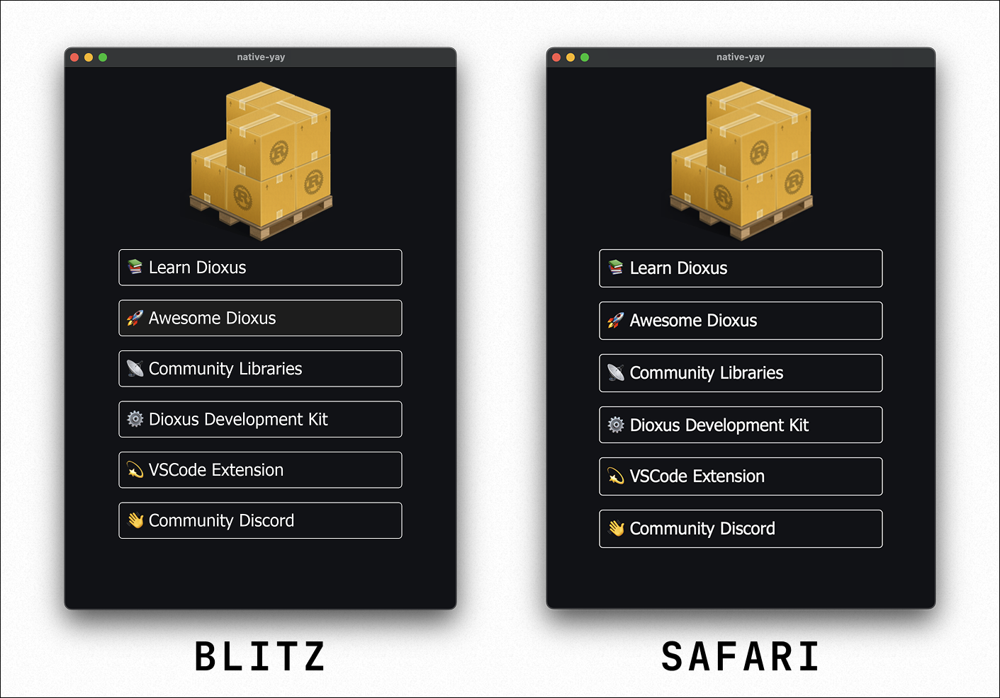

## 介绍 RSX

Dioxus 应用由若干小元素组成，这些元素被封装为组件，然后以树状结构进行组装。为了构建我们的组件，我们采用了 Rust 代码与一种简化的 Rust 方言的组合，我们称之为"RSX"。

RSX 的设计理念融合了 HTML 与 SwiftUI 的风格与体验：

```rust
rsx! {
    h1 { "欢迎来到 Dioxus！" }
    h3 { "由{author}倾情打造" }
    p { class: "main-content", {article.content} }
}
```

目前，RSX 是开发者构建 Dioxus 应用的主要语法。当然也有其他选项，但 RSX 拥有最佳的开发工具支持，比如即时热重载、代码折叠以及语法高亮等功能。

### rsx! 宏

如果您熟悉 React 或 Vue 这类库，那么您很可能对 JSX 标记语言并不陌生。JSX 是一种替代 JavaScript 的形式，它允许开发者在同一文件中混合使用 JavaScript 代码与 XML。这些库依赖于编译器插件将这种语法转换为纯 JavaScript 代码，进而渲染出 HTML。

在 Rust 中，我们通过使用 [`过程宏`](https://doc.rust-lang.org/reference/procedural-macros.html) 实现了类似的效果。过程宏是小型的编译器插件，能够将 Rust 标记转换为 Rust 代码。您可以通过`!`修饰符识别一个函数是一个过程宏。例如，`rsx!`宏会将 RSX 语法转换为 Rust 代码：

```rust
// 这个宏...
rsx! {
    div { "hello {world}!" }
}

// 展开后变成如下模板：
static TEMPLATE: Template = Template {
    nodes: [
        ElementNode {
            tag: div,
            children: [
                TextNode {
                    contents: DynamicText(0)
                }
            ]
        }
    ]
}
TEMPLATE.render([
    format!("hello {world}")
])
```

RSX 为我们承担了大量的繁重工作，大幅减少了声明 UI 时的冗长繁琐。同时，它以最高效的表示形式构建我们的 UI，使得渲染速度极快。

### Dioxus 渲染 HTML 和 CSS

我们希望确保 Dioxus 易于学习且具备极强的可移植性。与其发明一套全新的样式、布局与标记系统，我们选择直接在所有地方依赖 HTML 和 CSS。对于 Web 来说，这非常方便——网站本身就已经用 HTML 和 CSS 构建。在桌面和移动端，我们提供了一个渲染器，它可以自动将您的 HTML 和 CSS 转换为原生控件。

我们的混合 HTML 方案结合了 Flutter 和 React Native 等框架的最佳特性。团队可以实现最大程度的代码复用，使用熟悉的标记语言进行开发，而且 AI 工具也能立即派上用场。相比为每个平台单独开发原生应用，团队只需编写一次组件，就能在任何平台上进行渲染。

我们的渲染引擎 [`Blitz`](https://github.com/dioxuslabs/blitz) 是开源的，其表现往往与浏览器级引擎无异：



如果您还不熟悉 HTML，本指南将帮助您快速掌握基础知识。如需了解更多细节，[MDN 文档](https://developer.mozilla.org/en-US/docs/Web/HTML) 是个绝佳资源。许多工具还提供了可视化设计器或 AI 辅助功能，方便您从 HTML 元素构建 UI。

### 多种渲染器选项

Dioxus 具有高度模块化的特点。由于 RSX 的表示方式是通用的，您甚至可以替换其中的元素，选择渲染非 HTML 和 CSS 构成的 UI。尽管 Dioxus 团队计划仅维护基于 HTML/CSS 的渲染器，但第三方渲染器也已出现，它们能解锁更多扩展功能。

例如，[`Freya`](https://freyaui.dev/) 项目就使用 Google 的 Skia 渲染器来渲染 Dioxus 树。Skia 采用纯 CPU 架构，可在多种设备上运行，并提供了对 UI 效果更深入的控制能力：


Dioxus 团队维护着三种第一方渲染器：
- **Dioxus-Web**：一个兼容 Web 的引擎，直接渲染到 HTML DOM 节点
- **Dioxus-WebView**：一个桌面与移动端引擎，渲染到系统的 WebView
- **Dioxus-Native**：一个桌面与移动端引擎，渲染到原生控件

其中，Web 和 WebView 渲染器是最成熟的引擎，而 Dioxus-Native 仍在经历大量的改进。
