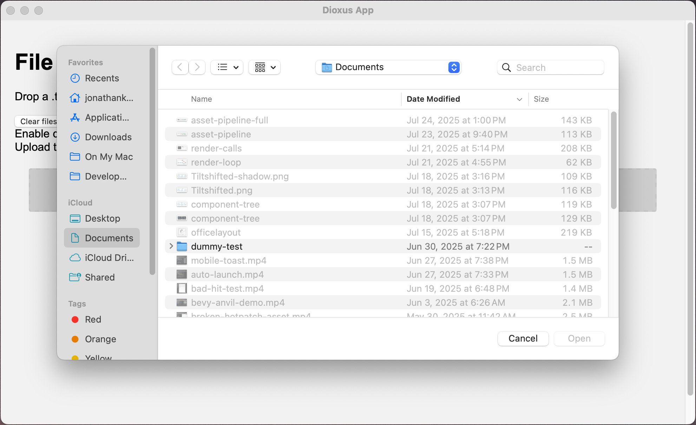

# 逃生舱口

尽管 RSX 功能极为强大，但某些 UI 方面的改动需要对系统小部件进行底层访问，或者采用命令式编程方式。Dioxus 提供了一系列"逃生舱口"，让你能够使用那些不适合声明式 RSX 范式的替代 UI 技术。此外，Dioxus 还相当年轻，可能尚未支持所有特定于平台的渲染器所具备的功能。

## 自定义元素属性

在底层，Dioxus 将每个元素属性都声明为一组常量，用于描述该属性的静态特性。这种定义大致等同于以下伪代码：

```rust
struct video;
impl video {
    const src: AttributeDefinition = AttributeDefinition {
        name: "src",
        namespace: None,
        type: String
    };
    const autoplay: AttributeDefinition = AttributeDefinition {
        name: "controls",
        namespace: None,
        type: Boolean
    };
}

//
rsx! {
    video { src: "...", autoplay: true }
}
```

在某些情况下，可能会缺少某个属性的声明，或者你需要使用自定义名称。RSX 通过用引号包裹属性名来实现这一点。只需将自定义属性的名称用引号括起来，并传入任何能计算出 `IntoAttributeValue` 的表达式即可：

```rust
rsx! {
    div {
        "data-my-button-id": 123
    }
}
```

当使用数据属性和自定义 CSS 选择器时，自定义属性会非常方便。

## 危险的内联 HTML

如果你处理的是预渲染资源、模板输出或 JS 库的输出，那么你可能希望直接传递 HTML，而无需经过 Dioxus。在这种情况下，可以使用 `dangerous_inner_html`。这个属性会将元素的 HTML `textContent` 字段设置为提供的值。这将覆盖该元素的其他任何属性或子元素。

例如，如果要开发一个从 Markdown 转换为 Dioxus 的工具，可能会显著增加最终应用的体积。相反，你应该预先将 Markdown 渲染为 HTML，然后直接在输出中包含这些 HTML。我们正是这样处理 [Dioxus 主页](https://dioxuslabs.com) 的：

```rust
// 这应来自可信来源
let contents = "live <b>dangerously</b>";

rsx! {
    div { dangerous_inner_html: "{contents}" }
}
```

> 注意！这个属性名为 "dangerous_inner_html"，是因为传递你不信任的数据是危险的。如果不小心，你很容易向用户暴露[跨站脚本攻击（XSS）](https://en.wikipedia.org/wiki/Cross-site_scripting)。

如果你处理的是不可信输入，请务必在将其传递给 `dangerous_inner_html` 之前对 HTML 进行清理——或者直接传递给文本元素以转义所有 HTML 标签。

## Web 组件

虽然我们通常建议直接在 Dioxus 中创建新组件，但第三方组件可能以 [Web 组件](https://www.webcomponents.org) 的形式分发。Web 组件提供了一种与框架无关的方式来构建和分发自定义 HTML 元素。

任何名称中带有短横线的元素都是 Web 组件。Web 组件在 Dioxus 中直接渲染，无需类型检查。一般来说，你会将 Web 组件*导入*到 Dioxus 中。因此，我们建议将 Web 组件包装在一个类型安全的组件中，以便更轻松地使用。

```rust
rsx! {
    my-web-component {}
}
```

由于 Web 组件是无类型的，它们没有默认属性。每个属性名都必须用引号括起来，这也是我们建议将 Web 组件包装在 Dioxus 组件中的原因：

```rust
#[component]
fn MyWebComponent(name: String, age: i32) -> Element {
    rsx! {
        my-web-component {
            "name": "hello, {name}",
            "age": age + 10
        }
    }
}
```

## 直接访问 DOM

如前所述，RSX 是*声明式*的。你在 `rsx! {}` 块中组合元素，由 Dioxus 负责渲染。有时，你需要更低级别的 DOM 元素访问权限，以构建深度交互的 UI。这可能涉及渲染到画布元素，或对元素属性进行同步修改。

为了直接访问底层的 [HTML DOM](https://developer.mozilla.org/en-US/docs/Web/API/Document_Object_Model/Introduction)，Dioxus 提供了一些内置机制：

- 通过 `eval` 运行 JavaScript
- 使用 [web-sys](https://docs.rs/web-sys/latest/web_sys/) 按 ID 获取元素
- 使用 `onmounted` 事件处理器
- 使用 `onresize` 和 `onvisible` 事件

### Eval

Dioxus 提供了一个 `eval` 函数，允许你在平台渲染器中评估任意 JavaScript。在 Web 上，它使用 [web-sys](https://docs.rs/web-sys/latest/web_sys/)；对于 WebView 渲染器，则使用 WebView 原生的 `eval` 方法。

你可以评估任何有效的 JavaScript。Dioxus 会将输入源码转换为一个 `Function` 声明，然后允许你捕获其结果。要向 JavaScript 发送自定义数据，我们只需格式化源码。要从 JavaScript 返回数据，我们使用 `dioxus.send()` 和 eval 的 `.recv()` 方法：

```rust
use dioxus::prelude::*;

fn app() -> Element {
    rsx! {
        button {
            onclick: move |_ | async move {
                // 你可以通过 `eval` 返回对象上的 `send` 方法，将值从 Rust 发送到 JavaScript 代码。
                let mut eval = document::eval(
                    r#"
                    for(let i = 0; i < 10; i++) {
                        // 你可以通过 `dioxus.send()` 方法异步发送值。
                        dioxus.send(i);
                    }"#
                );
                
                // 你可以通过 `eval` 返回对象上的 `recv` 方法，从 JavaScript 代码接收值。
                for _ in 0..10 {
                    let value: i32 = eval.recv().await.unwrap();
                    println!("Received: {}", value);
                }
            },
            "Log Count"
        }
    }
}
```

### 使用 web-sys 和事件向下转型

在 Web 上，可以使用 [web-sys](https://docs.rs/web-sys/latest/web_sys/) crate 直接从 Rust 调用 JavaScript 方法。这利用了外部函数接口来弥合 Rust 和 JavaScript 之间的鸿沟。我们并不一定建议在*所有*情况下都使用 web-sys，因为 web-sys 目前无法移植到 Dioxus 桌面和移动渲染器。

借助 web-sys，我们可以用强类型 Rust 接口调用大多数 JavaScript 方法：

```rust
rsx! {
    let alert_it = move |_| {
        let window = web_sys::window().unwrap();
        window.alert_with_message("Hello from Rust!");
    };
    button { onclick: alert_it, "Click to alert" }
}
```

### 使用 getElementById

在使用 eval 或 web-sys 时，直接获取 HTML Dom 节点的句柄会很有用。一般而言，我们建议为某个元素设置一个唯一 ID，然后使用 `getElementById` 稍后引用该节点。

```rust
// 为 div 设置一个唯一 ID
let id = use_hook(|| Uuid::new_v4());

// 在 eval 逻辑中引用它
let set_div_contents = move |_| async {
    dioxus::document::eval(format!(
        r#" document.getElementById("{{div-{id}}}").innerText = "one-two-three" ;"#
    ).await;
};

rsx! {
    // 然后在元素本身上分配 ID
    div { id: "div-{id}" }
    button { onclick: set_div_contents, "Set Div Directly" }
}
```

### 子窗口和叠加层

一些应用需要对 HTML [canvas](https://developer.mozilla.org/en-US/docs/Web/HTML/Reference/Elements/canvas) 元素进行底层访问。例如，计算机辅助设计（CAD）应用、视频游戏、照片编辑器、视频编辑器，或者任何依赖大量多媒体的应用，可能希望手动渲染 GUI 纹理。

当使用 WebView 渲染器时，你可以将 Dioxus 的 HTML 内容*叠加*在原生纹理之上。这是一种高级逃生舱口，解锁了整个渲染管线——功能强大，但也相当复杂。


> 更多信息请参阅 [GitHub 上的公司示例](https://github.com/DioxusLabs/dioxus/blob/main/examples/wgpu_child_window.rs)。

### 在 Tauri 中使用 Dioxus

如果你*需要*在桌面和移动平台上使用 web-sys，那么 [Tauri](https://tauri.app) 对你可能很有帮助。Tauri 是一个框架，允许你通过 IPC 边界结合自定义前端与原生运行的 Rust 代码。这与 Dioxus 有些类似，但你的 UI 代码不是原生运行，而是作为 WebAssembly*在 WebView 中运行。这种方式可能较慢且设置更复杂，但确实能实现跨平台的直接 DOM 访问。

Dioxus-Web 在创建新 Tauri 应用时被支持为一种前端选项，所以请务必查看他们的[文档](https://tauri.app/start/)。

### 原生小部件

第一方 Dioxus 渲染器目前仅渲染 HTML 和 CSS。这要么通过 web-sys 的 `HTMLDomElement` 配合 web-sys 完成，要么通过针对 WebView 渲染器的 eval 完成。有时，你希望渲染一个平台原生的小部件。内部，Dioxus 使用这一特性打开文件对话框、颜色选择器，并提供在平台一致性至关重要的功能。



这属于比较高级的用法，需要使用 FFI 调用 Objective-C 和 Kotlin 来使用系统库。更多详情请参阅 [dioxus-desktop 文档](https://crates.io/crates/dioxus-desktop)。

### Dioxus Native

为了对 DOM 拥有*完全*控制权，我们开发了 **Dioxus Native** 渲染器。这个渲染器结合了平台原生小部件与精简版的 HTML/CSS 渲染器，可将 Dioxus 组件树直接绘制到屏幕上。目前，Dioxus Native 支持多种基于 [Vello](https://github.com/linebender/vello) 的后端。

Dioxus Native 尚处于起步阶段。我们专门开发 Dioxus Native，是为了将任意 GPU 纹理绘制到画布元素中。不用再使用子窗口和叠加层，你可以直接将 WGPU 纹理注入 HTML 元素。同样，你也可以将 Dioxus 嵌入任何现有的 WGPU 应用，比如 Bevy 游戏。


更多信息请参阅 [dioxus-native crate](https://crates.io/crates/dioxus-native)。

