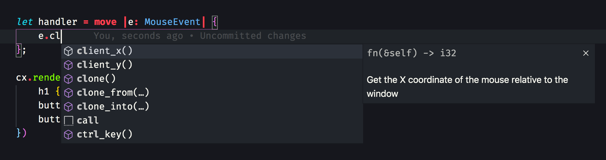
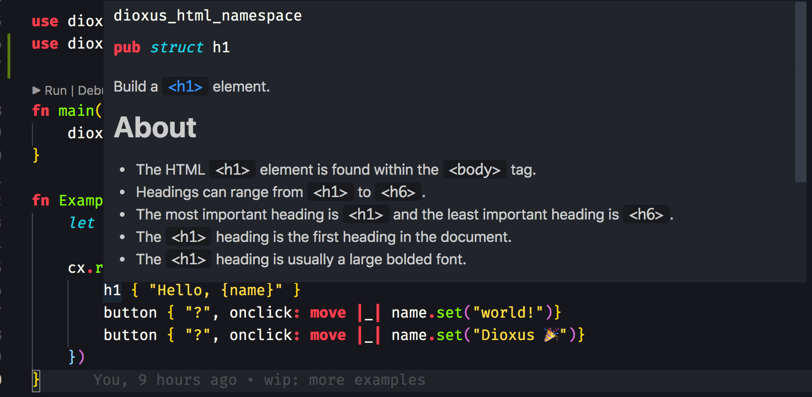
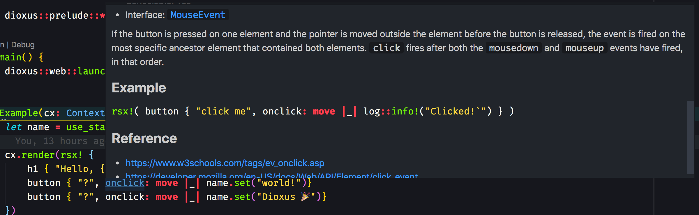

# 属性

虽然我们可以通过组装未设置样式的元素和文本来构建 UI，但我们通常希望自定义它们的外观和行为。这时我们需要使用元素属性。属性为渲染器提供了关于如何显示 UI 的额外信息。

你可以通过在元素主体中添加属性名称、冒号和值来指定属性。例如，我们可能想用特定的 class 和 ID 来设置 div 的样式：

```rust
rsx! {
    div {
        class: "container",
        id: "root-container"
    }
}
```

我们可以使用属性来设置 input 元素的 type。默认类型是 text，显示文本输入框，但我们可以将其设置为 number，使其只接受数字：

```rust
rsx! {
    input { type: "number" }
}
```

与文本节点类似，属性可以包含格式化的片段。我们可以将 input 元素的值设置为信号来控制它：

```rust
let mut value = use_signal(|| "Hello world".to_string());
rsx! {
    input { value: "{value}" }
}
```

## 属性范围

每个元素都有两组属性：

- [全局属性](https://developer.mozilla.org/en-US/docs/Web/HTML/Reference/Global_attributes)：可以应用于每个元素的属性
- [特定属性](https://developer.mozilla.org/en-US/docs/Web/HTML/Reference/Attributes)：仅适用于特定元素的属性

例如，所有元素都支持 id 和 class 属性，但只有 video 元素支持 autoplay 属性。有关属性的完整列表，请访问上述链接。

## IDE 支持

RSX 为元素及其属性提供了自动补全和内联文档支持。要获取自动补全建议，只需在编辑器中开始输入：



我们从 [Mozilla 开发者文档](https://developer.mozilla.org/en-US/docs/Web) 中提取了文档来说明每个元素。只需将光标悬停在元素上即可获取更多信息：



同样的文档也适用于属性：



## 非文本属性

通常，你会使用格式化文本来为元素添加属性。然而，属性可以接受多种值类型，包括：

- Text：格式化文本、String 类型，或任何实现 Display 的类型
- Float：浮点数，通常用于滑块和输入
- Int：整数，用于离散的增量
- Bool：表示 true/false 的布尔值
- Listener：当属性被触发时执行的 Rust 回调
- Any：类型擦除的 `Rc<dyn Any>`，通常由第三方渲染器使用
- None：属性将从元素中完全移除

最常见的是，你可以使用 bool 属性来设置布尔状态：

```rust
rsx! {
    input {
        type: "checkbox",
        checked: true
    }
}
```

或者使用 Some/None 变体来设置 HTML 布尔属性：

```rust
rsx! {
    div { itemscope: Some("scope") }
}
```

请注意，Dioxus 会自动将某些属性的 false 转换为 None，以匹配 [HTML 布尔属性](https://developer.mozilla.org/en-US/docs/Glossary/Boolean/HTML)的行为。

## 事件监听器

虽然某些属性影响元素的渲染方式，但其他属性影响其交互行为。这些属性称为事件监听器，允许你对用户输入做出响应。

在 RSX 中，事件处理程序总是以 on 开头。语法与普通属性相同，但事件处理程序只接受响应事件的闭包。我们可以为 input 元素的 oninput 事件附加一个事件监听器，以监听输入的变化：

```rust
rsx! {
    input {
        oninput: move |event| {
            println!("Input changed to: {}", event.value());
        },
    }
}
```

有关事件监听器的更多信息，包括事件如何冒泡以及如何阻止默认行为，可以在 Reactivity 部分的[事件处理程序](https://dioxuslabs.com/learn/0.7/essentials/basics/event_handlers)中找到。

有大量的事件监听器可用——有关详细信息，请参阅完整的 [HTML 列表](https://developer.mozilla.org/en-US/docs/Web/Events)。

## 展开属性

有时，你想要传递给元素的属性集合可能是动态的，或者在你的应用程序的其他地方定义。在这些情况下，你可以使用 `..` 语法将属性列表展开发到元素中。通常，属性列表会通过组件的属性传递，这将在后面的章节中介绍。

```rust
let attributes = vec![
    Attribute {
        name: "id",
        namespace: None,
        volatile: false,
        value: "cool-button".into_value(),
    }
];

rsx! {
    button { ..attributes, "button" }
}
```

属性列表将按照它们出现的顺序合并，因此列表中后面的属性优先于前面的属性。在将 UI 重构为可复用的组件库时，属性展开展得非常有用。

## 特殊属性

RSX 中的大多数属性都是按原样渲染的，但也有一些例外。在某些情况下，RSX 偏离传统的 HTML，以简化开发或更好地与生态系统工具配合。

### 条件属性

你可以通过将属性值设置为未终止的 if 语句来有条件地设置属性。如果 if 语句计算为 true，则将设置属性：

```rust
let number_type = use_signal(|| false);
rsx! {
    input { type: if number_type() { "number" } }
}
```

### 样式属性

除了标准的 style 属性外，每个样式也可以作为单独的属性传递。例如，我们可以使用 color 和 font_size 属性来设置元素的颜色和字体大小：

```rust
rsx! {
    div { style: "width: 20px; height: 20px; background-color: red; margin: 10px;" }
    div {
        width: "20px",
        height: "20px",
        background_color: "red",
        margin: "10px",
    }
}
```

### class 属性

大多数属性每个元素只能定义一次，但 class 属性可以定义多次。每个 class 都将被添加到元素的 class 列表中。在为像 TailwindCSS 这样的样式系统中的元素添加许多可选 class 时，这会很方便：

```rust
rsx! {
    span {
        class: if red { "bg-red-500" },
        class: if blue_border { "border border-blue-500" },
        class: "w-4 h-4 block",
    }
}
```

此功能在使用 TailwindCSS 时尤为重要，因为 class 编译器在收集 class 时不理解格式化的 Rust 字符串。通过将动态 class 放在兄弟属性中，Tailwind 编译器在编译时可以看到两个 class 列表。

### onresize 和 onvisible

Dioxus 提供了两个 HTML 规范中不存在的自定义 HTML 属性：

- onresize
- onvisible

Dioxus 会自动构建一个跨平台的 IntersectionObserver，为你发出相应的事件。

使用 onresize，你可以监视元素大小和位置的变化：

```rust
fn app() -> Element {
    let mut items = use_signal(|| 100);

    rsx! {
        // 添加值会导致 `div` 重新渲染并添加一个额外的 div
        button { onclick: move |_| items += 1, "Add one" }

        div {
            // 当 `div` 调整大小时，这将被调用
            onresize: move |data| {
                info!("resized to {:#?}", data.get_border_box_size().unwrap());
            },

            for x in 0..items() {
                div { "{x}" }
            }
        }
    }
}
```

使用 onvisible，你可以处理元素进入和退出视口的情况。这对于实现延迟加载、无限滚动和虚拟列表等功能非常有用：

```rust
fn app() -> Element {
    rsx! {
        div {
            onvisible: move |data| info!("visibility changed"),
            "Hello world!"
        }
    }
}
```

你可以在不编写自定义 JavaScript 的情况下为应用添加丰富的滚动感知动画。


### 自定义属性

Dioxus 有一组在编译时进行验证的预配置属性。如果你用引号将属性名称括起来，则可以使用预定义集之外的自定义属性：

```rust
rsx! {
    div { "style": "width: 20px; height: 20px; background-color: red;" }
}
```

请注意，这甚至适用于事件监听器。我们偶尔使用它在编写相应的 web-sys 代码可能过于冗长时，将小的 JavaScript 片段插入到我们的应用程序中：

```rust
rsx! {
    button {
        "onclick": "navigator.clipboard.writeText(window.document.title);",
        "Copy to clipboard"
    }
}
```

### HTML 逃生舱

如果你正在使用预渲染的资源、模板输出或 JS 库的输出，则可能希望直接传递 HTML，而不是通过 Dioxus。在这些情况下，请使用 `dangerous_inner_html`。

`dangerous_inner_html` 将元素的文本内容设置为提供的值。这将覆盖元素的任何其他属性或子元素。

例如，部署 markdown 到 Dioxus 转换器可能会显著增加最终应用程序的大小。相反，你可能希望将 markdown 预渲染为 HTML，然后直接在输出中包含 HTML。我们在 [Dioxus 主页](https://dioxuslabs.com)上使用了这种方法：

```rust
// 这应该来自受信任的来源
let contents = "live <b>dangerously</b>";

rsx! {
    div { dangerous_inner_html: "{contents}" }
}
```

> 注意！此属性称为 "dangerous_inner_html"，因为向其传递不受信任的数据是**危险的**。如果不小心，你很容易将 [跨站脚本（XSS）](https://en.wikipedia.org/wiki/Cross-site_scripting)攻击暴露给用户。
>
> 如果你正在处理不受信任的输入，请确保在将其传递到 `dangerous_inner_html` 之前对你的 HTML 进行清理——或者只是将其传递给文本元素以转义任何 HTML 标签。
