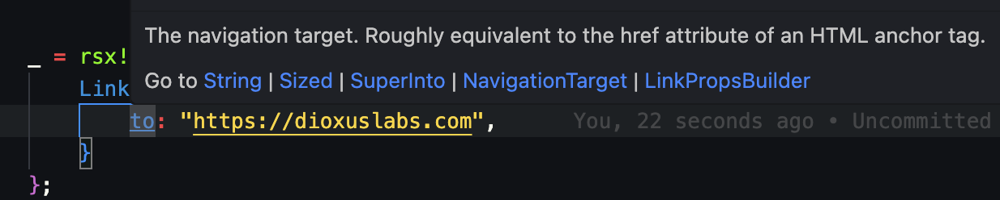
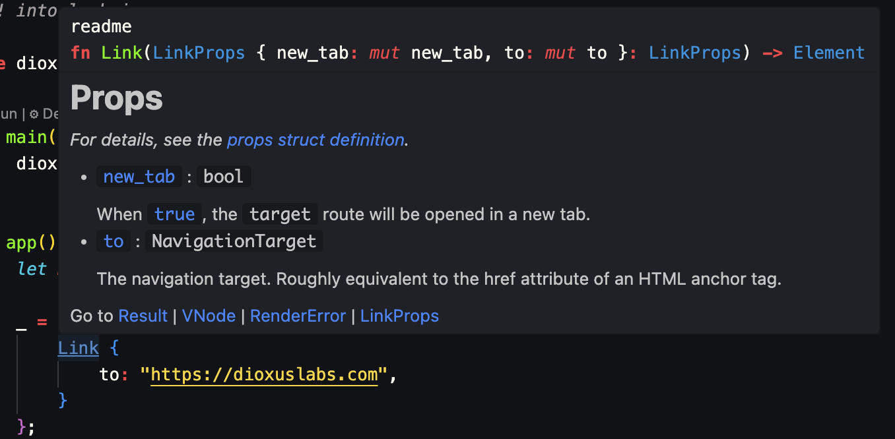

# 组件与属性

在 Dioxus 中，组件是用于封装 UI 的呈现、状态和交互的简单函数。随着应用规模的扩大，建议将共享功能组合成更小、可复用的组件。模块化的组件有助于大型团队协作，避免烦人的 bug，并实现跨平台的更好代码复用。

## 定义组件

最简单的组件就是一个返回 `Element` 的函数。例如，基础应用组件：

```rust
fn app() -> Element {
  rsx! { "hello world!" }
}
```

如果希望从另一个组件中使用某个组件，则必须使用 `#[component]` 宏对函数进行标注。该宏为 RSX 宏提供了必要的元数据，使得函数参数能够成为组件属性中的字段。您的函数需满足以下要求：

- 函数名以大写字母开头（`MyComponent`）或包含下划线（`my_component`）
- 参数类型需实现 `PartialEq` 和 `Clone`
- 返回一个 `Element`

我们把组件所接收的参数称为组件的**属性**（properties）。属性用于向组件传递数据，类似于向函数传递参数的方式。

例如，我们可以定义一个简单的组件，它接受一个 `name` 属性并渲染一条问候语：

```rust
#[component]
pub fn MyComponent(name: String) -> Element {
    rsx! {
        div {
            h3 { "Hello, {name}!" }
        }
    }
}
```

## 在 RSX 中使用组件

一旦定义了组件，您就可以像使用其他元素一样，在 RSX 标记中使用它：

```rust
rsx! {
    MyComponent { name: "World" }
}
```

尽管组件被定义为函数，但不应像普通函数那样调用。当您在 RSX 中使用组件时，Dioxus 会创建一个新的组件实例，该实例控制自身的状态和生命周期。

## 组件属性

组件的属性是在组件渲染时传入的对象。这些属性类似于函数的参数——这也是为什么组件中的属性字段被定义为函数参数的原因。在某些情况下，您可能会发现将组件属性提取到单独的结构体中很有用。与其在组件内直接定义属性，我们只需使用名为 `props` 的参数，然后在配套的结构体中定义 props 即可。

```rust
#[derive(PartialEq, Clone, Props)]
struct CardProps {
  title: String,
  content: String
}

#[component]
fn Card(props: CardProps) -> Element {
  rsx! {
      h1 { "{props.title}" }
      span { "{props.content}" }
    }
}
```

当我们把属性提取到结构体中时，需要确保该结构体实现了三个必需的 trait：

- `PartialEq`：用于判断组件是否需要重新渲染
- `Clone`：每次渲染时，属性对象都会被克隆
- `Props`：派生 `Properties` trait，Dioxus 用其进行渲染和构建

这些约束条件对组件属性的结构设计都有影响。

### PartialEq

Dioxus 运行时使用 `PartialEq` 来判断组件的属性是否因用户操作而发生变化。由于组件会被其他组件调用，组件树中属性的小变化可能导致 Dioxus 运行时产生连锁反应。`PartialEq` 的实现用于最小化 Dioxus 运行时在响应这些变化时所需的工作量。

对于高级用例，自定义属性的 `PartialEq` 实现可能有助于提升性能。例如，我们可能希望仅通过 ID 比较大数据集，而不比较实际内容。在这种情况下，我们可以手动实现 `PartialEq` trait，跳过数据集的相等性检查：

```rust
#[derive(Clone, Props)]
struct DatasetViewer {
  id: Uuid,
  contents: Vec<u8>
}

impl PartialEq for DatasetViewer {
  fn eq(&self, other: &Self) -> bool {
      self.id.eq(&other.id)
  }
}
```

许多 Dioxus 工具使用指针比较而非内容比较，以提高性能。

### Clone

`Clone` 约束对组件属性来说是一个特别有趣的限制。Dioxus 组件树架构围绕一种称为**单向数据流**的设计理念构建。这种设计模式防止组件树中的组件修改其输入属性。通过防止这些意外的修改，用户界面通常能减少 bug。Rust 本身通过其借用检查器系统解决了这个问题，但借用检查器并不适用于异步工作，而这在应用开发中相当普遍。

一般来说，大多数组件属性都可以安全地调用 `.clone()`，但有些对象可能过于昂贵，克隆会负面影响性能。在大多数情况下，您可以简单地将值包装在 `ReadSignal` 包装器类型中，对象就会自动被包裹在智能指针中：

```rust
// 之前...
struct CardProps {
  content: String
}

// 使用 ReadSignal：
struct CardProps {
  content: ReadSignal<String>
}
```

幸运的是，调用端无需做任何代码更改：

```rust
rsx! {
  CardProps {
    content: query.content()
  }
}
```

需要注意的是，`ReadSignal` 不仅是一种智能指针。Rust 的智能指针（`Arc`、`Rc`）也能让克隆变得更便宜，自定义 `Clone` 实现同样有效。

### Props

`Props` derive 宏为属性对象实现了 `Properties` trait。这个 trait 及其实现是 Dioxus 内部的实现细节，一般不建议手动实现。`Props` derive 很有用，因为它为 `Properties` 生成了一个强类型的构建器。我们甚至可以在 RSX 之外使用这个构建器：

```rust
let props = CardProps::builder().content("body".to_string()).build();
```

## #[component] 宏

属性可以被修改，以接受比普通函数参数更广泛的输入类型。我们这里没有涵盖所有细节，但您可以在 [组件宏](https://docs.rs/dioxus/latest/dioxus/prelude/attr.component.html) 文档中找到相关信息。

例如，Dioxus Router `Link` 组件大量使用了修饰符：

```rust
/// The properties for a [`Link`].
#[derive(Props, Clone, PartialEq)]
pub struct LinkProps {
    /// The class attribute for the `a` tag.
    pub class: Option<String>,

    /// A class to apply to the generate HTML anchor tag if the `target` route is active.
    pub active_class: Option<String>,

    /// The children to render within the generated HTML anchor tag.
    pub children: Element,

    /// When [`true`], the `target` route will be opened in a new tab.
    ///
    /// This does not change whether the [`Link`] is active or not.
    #[props(default)]
    pub new_tab: bool,

    /// The onclick event handler.
    pub onclick: Option<EventHandler<MouseEvent>>,

    /// Whether the default behavior should be executed if an `onclick` handler is provided.
    ///
    /// 1. When `onclick` is [`None`] (default if not specified), `onclick_only` has no effect.
    /// 2. If `onclick_only` is [`false`] (default if not specified), the provided `onclick` handler
    ///    will be executed after the links regular functionality.
    /// 3. If `onclick_only` is [`true`], only the provided `onclick` handler will be executed.
    #[props(default)]
    pub onclick_only: bool,

    /// The rel attribute for the generated HTML anchor tag.
    ///
    /// For external `a`s, this defaults to `noopener noreferrer`.
    pub rel: Option<String>,

    /// The navigation target. Roughly equivalent to the href attribute of an HTML anchor tag.
    #[props(into)]
    pub to: NavigationTarget,

    #[props(extends = GlobalAttributes)]
    attributes: Vec<Attribute>,
}
```

您可以对每个字段使用 `#[props()]` 属性，以修改组件所接受的属性：

- `#[props(default)]` - 使字段在组件中变为可选，若未设置则使用默认值
- `#[props(!optional)]` - 使 `Option<T>` 类型的字段变为必填
- `#[props(into)]` - 通过 [`Into`] trait 将字段转换为正确的类型
- `#[props(extends = GlobalAttributes)]` - 将元素的所有属性或全局元素属性扩展到 props 中

Props 在以下情况下表现略有不同：

- `Option<T>` - 字段自动变为可选，默认值为 `None`
- `ReadOnlySignal<T>` - props 宏会自动将 `T` 转换为 `ReadOnlySignal<T>`，当作为 prop 传入时
- `String` - props 宏会接受格式化的字符串作为任意 `String` 类型的 prop 字段
- `children: Element` - props 宏会接受子元素，如果您包含 `children` prop
- `EventHandler<T>` 强制闭包

需要注意的是，这些属性既适用于基于结构体的属性定义，也适用于内联定义：

```rust
#[component]
fn Link(
    /// When [`true`], the `target` route will be opened in a new tab.
    #[props(default)]
    new_tab: bool,

    /// The navigation target. Roughly equivalent to the href attribute of an HTML anchor tag.
    #[props(into)]
    to: NavigationTarget,
) -> Element {
  // ...
}
```

由于文档注释由 `#[component]` 宏解析，它们会在调用组件时作为内联文档可用：



鼠标悬停在组件上时，组件的文档也会显示出来：



## 展开 Props

为了提高组合性，我们可以手动创建组件的属性，然后直接使用 Rust 的展开语法 `..some_props` 将其传入。

```rust
let props = CardProps::lorem_ipsum();
rsx! {
  Card { ..props }
}
```

这种机制的行为类似于 Rust 的结构体展开，允许您覆盖展开的各种字段，从而实现默认值和覆盖：

```rust
let props = CardProps::lorem_ipsum();
rsx! {
  Card { title: "Chapter 1", ..props }
}
```

## 子元素

属性有一个特殊的字段叫做 `children`，它包含了组件的子元素。例如，我们可以构建一个包装组件，将子元素包裹在一个红色 div 中。这个组件接受一个名为 `children` 的特殊参数，它是 RSX 表达式中使用的 `Element`。

```rust
#[component]
fn RedDiv(children: Element) {
  rsx! {
    div {
      background_color: "red",
      {children}
    }
  }
}
```

调用组件时，我们可以像添加元素一样添加嵌套的子元素：

```rust
rsx! {
  RedDiv {
    h1 { "Lorem Ipsum Dolor" }
    p { "..." }
  }
}
