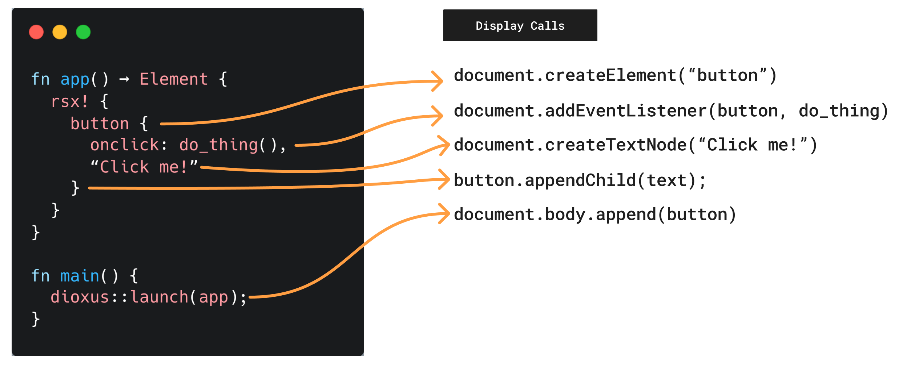
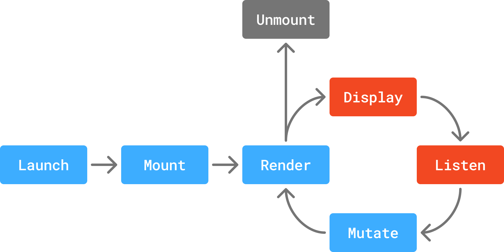

# 协调：组件如何渲染

我们已经详细介绍了组件及其属性的定义方式，但尚未涉及它们的实际工作原理。Dioxus 组件并非普通的 Rust 函数。尽管从技术上讲，可以像调用普通 Rust 函数那样调用它们，但组件要正常运行，必须依赖一个活跃的 Dioxus 运行时。

为了正确使用组件，理解状态流动的基本原理、元素的创建方式以及状态的存储机制至关重要。我们将在本节中概述状态的工作原理，不过状态本身可能较为复杂，因此我们专门为此安排了[一章](./3-The%20Basics%20of%20State.md)内容。

## 组件的渲染

在 Dioxus 中，"渲染"一词指的是 Dioxus 用来调用你的组件函数并将元素绘制到屏幕上的过程。当你调用 `dioxus::launch` 时，Dioxus 会设置应用的运行时，然后调用你提供的初始组件以创建初始元素。这个初始元素会声明样式、布局、子元素和事件监听器。Dioxus 会将你的元素转换为绘制调用，并将你的事件监听器转换为原生事件处理器。



由于 Dioxus 使用的是"虚拟"树，RSX 树中的元素并不是对渲染器中"真实"节点的实际引用。例如，Dioxus 的 `Element` 类型并不是完整的 [`HTMLElement`](https://developer.mozilla.org/en-US/docs/Web/API/HTMLElement) 对象。当 Dioxus 接收到你的初始元素后，它会利用特定于平台的渲染器，将你的虚拟元素转换为真实的元素和绘制调用。

## 组件的重新渲染

当组件所依赖的状态发生变化时，组件会被重新运行。在初始元素通过特定于平台的渲染器绘制完成后，Dioxus 会开始监听你的元素上的事件。当某个事件被触发时，对应的事件监听器会被调用，此时你的代码有机会修改状态。修改状态是 Dioxus 识别出需要再次运行组件函数并查找树中变化的主要机制。



Dioxus 认为以下两种情况会导致状态改变：

- 组件的属性发生变化，这由其 `PartialEq` 实现决定
- 组件所依赖的内部[状态](./3-The%20Basics%20of%20State.md)发生变化（例如 `signal.write()`），并且系统会安排一次"更新"

```rust
// 当 name 属性改变时，组件会重新渲染
#[component]
fn Button(name: String) -> Element {
    let mut count = use_signal(|| 0);
    log!("Component rerendered with name: {name} count: {count}");

    rsx! {
        h3 { "Hello, {name}!" }
        // MyComponent 读取了 `count` 信号，因此每当 `count` 改变时
        // 它都会重新渲染。
        "Count: {count}"
        button {
            // 当按钮被点击时，它会增加计数信号
            onclick: move |_| count += 1,
            "Increment"
        }
    }
}
```

组件再次运行后，Dioxus 会比较旧的元素与新的元素，以找出差异。Dioxus 运行时会确定最少数量的绘制调用，从而将旧的 UI 调整为符合你期望的 UI。这一比较过程称为"差异计算"（diffing）。Dioxus 通过仅比较 RSX 中的动态部分来优化差异计算，因此静态元素不会被检查是否有变化（[详情请参阅这篇博客文章](https://dioxuslabs.com/blog/templates-diffing)）。整个循环——渲染、显示、监听、修改——被称为"协调"（reconciliation），而 Dioxus 拥有任何 UI 框架中最高效的实现之一。

## 组件是状态的函数

组件是以 `fn(State) -> Element` 形式表示的当前应用状态的纯函数。它们从各种来源读取状态，比如 props、[hooks](./2.2-Storing%20State%20in%20Hooks.md) 或 [context](./2.9-Global%20Context.md)，并返回当前 UI 的视图作为元素。

我们已经看到组件如何将 props 状态映射到 UI，但状态也可以来自组件自身，以钩子的形式提供。例如，我们可以使用信号来跟踪组件中的计数。组件定义了从信号的当前状态到应渲染的 UI 的映射关系：

```rust
#[component]
pub fn MyStatefulComponent() -> Element {
    let mut count = use_signal(|| 0);

    rsx! {
        div {
            h3 { "Count: {count}" }
            button { onclick: move |_| count += 1, "Increment" }
        }
    }
}
```

在构建 Dioxus 应用时，重要的是要明白，你的 UI 代码只是对你希望 UI 呈现的样子的声明——它并不包含任何关于如何更新 UI 以达到该目标的逻辑。Dioxus 本身负责让 UI 匹配你期望的输入。

## 组件是纯函数

组件的主体必须是纯函数。纯函数对于相同的输入总是返回相同的输出，并且没有副作用。例如，以下双倍函数就是纯函数：

```rust
fn double(x: i32) -> i32 {
    x * 2
}
```

如果你调用 `double(2)`，它总是返回 `4`。

然而，以下函数不是纯函数，因为它修改了外部状态：

```rust
static GLOBAL_COUNT: AtomicI32 = AtomicI32::new(0);

fn increment_global_count() -> i32 {
    GLOBAL_COUNT.fetch_add(1, Ordering::SeqCst)
}
```

第一次调用 `increment_global_count()` 时，它会返回 `0`；但下次调用时，它会返回 `1`。这个函数有副作用，因为它修改了全局状态。

除了全局变量，上下文和钩子也是组件中的外部状态。组件在渲染过程中不应修改来自上下文或钩子的状态：

```rust
// ❌ 从钩子中修改计数信号是有副作用的。
// Dioxus 可能会尝试用新值重新渲染组件，
// 这可能导致意外行为或无限循环。
count += 1;
```

修改状态的副作用应当放在事件处理器或 [effects](/learn/0.7/essentials/advanced/breaking_out#synchronizing-dom-updates-with-use-effect) 中，这些函数会在组件渲染完成后执行。这样可以确保组件的输出稳定且可预测。

```rust
// ✅ 事件处理器可以修改状态并产生副作用。
onclick: move |_| count += 1,
```

如果你发现自己编写的组件不是纯函数，那么很可能是在滥用或误解了响应式范式。修改状态的操作应当放在事件处理器中，作为对用户输入的响应，或者放在长时间运行的异步任务中，作为后台处理的响应。

## 类似于 React

如果你熟悉 ReactJS 之类的库，那么这种范式对你来说应该很熟悉。Dioxus 借鉴了许多来自 React 的思想，你已有的知识将会非常有用。如果这里有任何内容让你感到困惑，请查阅 [React 文档](https://react.dev/learn) 或进一步研究 React 的响应式系统。
