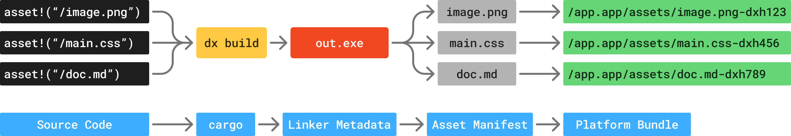

# 资产（Assets）

资产是包含在应用程序最终构建中的文件。它们可以是图片、字体、样式表，或者任何不是源文件的其他文件。Dioxus 提供了一流的资产支持，并为在应用程序中引入资产以及自动针对生产环境优化资产提供了简便的方法。

在 Dioxus 中，资产还与库兼容！如果你正在构建一个库，你可以将资产包含在你的库中，这些资产会自动包含在使用你库的任何应用程序的最终构建中。



## 包含图片

要在应用程序中包含一张图片，只需将资产路径包裹在 `asset!` 宏中即可：

```rust
use dioxus::prelude::*;

fn App() -> Element {
    // 你可以链接到相对于包根目录的资产，甚至可以从 URL 链接到一个资产
    // 这些资产会自动被 Dioxus CLI 捕获、优化，并与你的最终应用程序一起打包
    let ferrous = asset!("/assets/static/ferrous_wave.png");

    rsx! {
        img { src: "{ferrous}" }
    }
}
```

`asset!` 宏接受一个相对于应用根目录的资产路径。该路径不是你机器上的绝对路径，因此可以在多台机器上使用相同的资产路径。

```rust
// ❌ 不起作用！
let ferrous = asset!("/Users/dioxus/Downloads/image.png");
```

`asset!` 宏是 `const` 的，这意味着我们可以在内联使用它，或者将其作为静态/常量项使用：

```rust
// 作为静态项
static FERROUS: Asset = asset!("/assets/static/ferrous_wave.png");

// 或者内联
rsx! {
    img { src: asset!("/assets/static/ferrous_wave.png") }
}
```

## 自定义图片处理选项

你还可以使用 `asset!` 宏来优化、调整大小和预加载图片。选择一种优化后的文件类型（如 Avif）和合理的质量设置，可以显著减小图片大小，从而帮助你的应用程序更快加载。例如，你可以使用以下代码在应用程序中包含一张优化后的图片：

```rust
pub const ENUM_ROUTER_IMG: Asset = asset!(
    "/assets/static/enum_router.png",
    // 你可以向 `asset!` 宏传递第二个参数来设置资产选项
    ImageAssetOptions::new()
        // 你可以在编译时设置图片尺寸，以向客户端发送尽可能小的图片
        .with_size(ImageSize::Manual { width: 52, height: 52 })
        // 你还可以在编译时将图片转换为适合网络的格式。这可以使你的图片明显更小
        .with_format(ImageFormat::Avif)
);

fn EnumRouter() -> Element {
    rsx! {
        img { src: "{ENUM_ROUTER_IMG}" }
    }
}
```

## 包含样式表

你可以使用 `asset!` 宏在应用程序中包含样式表。样式表会在打包时自动进行压缩，以加快加载速度。例如，你可以使用以下代码在应用程序中包含一个样式表：

```rust
// 你也可以将样式表与应用程序一起打包
// 任何以 `.css` 结尾的文件都会被压缩并打包到你的应用程序中，即使你没有显式地在 `<head>` 中包含它们
const _: Asset = asset!("/assets/tailwind.css");
```

[Tailwind 指南](https://dioxuslabs.com/learn/0.7/guides/utilities/tailwind) 提供了更多关于如何在 Dioxus 中使用 Tailwind 的信息。

## SCSS 支持

SCSS 也通过 `asset!` 宏得到支持。你可以像常规 CSS 文件一样包含它。

你可以在 [manganis 文档](https://docs.rs/manganis/latest/manganis) 中了解更多关于资产以及所有可用于优化资产的选项。

## 包含任意文件

在 Dioxus 桌面版中，你可能希望包含一个带有数据的文件用于你的应用程序。如果你没有为资产设置任何选项，且文件扩展名未被识别，资产会被原样复制而不会做任何修改。例如，你可以使用以下代码在应用程序中包含一个二进制文件：

```rust
// 你也可以收集任意文件。相对路径会相对于包根目录解析
const PATH_TO_BUNDLED_CARGO_TOML: Asset = asset!("/Cargo.toml");
```

这些文件会自动包含在应用程序的最终构建中，你可以在应用程序中像使用其他文件一样使用它们。

## 资产哈希（Asset Hashes）

`asset!` 宏会在资产打包后自动为其名称附加一个哈希值。这使得你的应用程序打包后的资产在不同时间都保持唯一性，从而允许你在 Web 服务器或 [CDN](https://en.wikipedia.org/wiki/Content_delivery_network) 上无限缓存该资产。

```rust
// 打印 "/assets/ferrous_wave-dxhx13xj2j.png";
println!("{{}}", asset!("/assets/static/ferrous_wave.png"));
```

资产哈希是资产系统中一个极其强大的功能。哈希与 CDN 集成，可以极大地提升应用程序的加载性能，并帮你节省基础设施成本。

不过，有时你可能希望禁用它们。我们可以使用 `AssetOptions` 构建器来自定义资产处理选项：

```rust
let ferrous = asset!("/assets/static/ferrous_wave.png", AssetOptions::builder().with_hash_suffix(false));
```

## 基于链接器的资产打包（Linker-based Asset Bundling）

与 Rust 的 `include_bytes!` 宏不同，`asset!` 宏并不会将资产内容复制到你的最终应用程序二进制文件中。相反，它会将资产路径和选项添加到最终二进制文件的元数据中。当你运行 `dx serve` 或 `dx build` 时，我们会自动读取这些元数据并处理资产。

每个资产的元数据会通过 [const-serialize](https://crates.io/crates/const-serialize) crate 序列化其路径和属性，自动嵌入到最终可执行文件中。构建完成后，DX 会计算资产哈希并将它们写回二进制文件。

```rust
#[link_section]
static SERIALIZED_ASSET_OPTIONS: &[u8] = r#"{\"path\": \"/assets/main.css\",\"minify\":\"true\",\"hash\":\"dxh0000\"}"#;
```

这意味着资产不会永久烘焙到你的最终可执行文件中。最终可执行文件更小、加载更快，资产加载也更加灵活。这一点在浏览器等平台上尤为重要，因为资产会通过网络并行获取。

要动态加载资产内容，你可以使用 [dioxus-asset-resolver](https://crates.io/crates/dioxus-asset-resolver) crate，它能正确理解应用程序的打包格式，并根据资产的 `Display` 实现加载资产。

```rust
let contents = dioxus_asset_resolver::serve_asset(&asset!("/assets/main.css")).to_string();
```

## 必须使用资产，库中的资产

由于 Dioxus 使用程序的链接器保存资产元数据，因此返回的资产必须在你的应用程序中某个地方被使用。如果你忘记使用返回的资产，Rust 编译器可能会自由地优化掉这个调用，导致资产元数据不会出现在最终输出中：

```rust
let ferrous = asset!("/assets/static/ferrous_wave.png");
rsx! {
    // 我们的 ferrous png 不会被包含，因为我们忘了使用它！
    img { src: "..." }
}
```

这是预期的行为。我们设计了资产系统，使其能够自动修剪未使用的资产，从而让第三方库能够将其自身的资产作为公共 API 的一部分导出。例如，我们可以编写一个包含多个样式表的库：

```rust
// crate: cool_dioxus_library
pub static GREEN_STYLES: Asset = asset!("/assets/red.css");
pub static RED_STYLES: Asset = asset!("/assets/green.css");
```

当用户使用我们的库构建应用程序时，他们只需要导入想要使用的样式表：

```rust
fn main() {
    dioxus::launch(|| rsx!{
        link { href: cool_dioxus_library::GREEN_STYLES, rel: "stylesheet" }
    })
}
```

由于 `RED_STYLES` 资产从未被用户的应用程序引用，它不会被包含在最终输出中。

不过，你可能希望即使从未直接引用，也包含一个资产。这时 Rust 的 `#[used]` 属性就派上用场了，它向编译器标注该资产已被使用，即使我们在编译时无法证明这一点。

```rust
#[used]
static CERTS: Asset = asset!("/assets/keys.cert");
```

## 包含文件夹

`asset!` 宏还支持导入整个文件夹的内容！文件夹本身不会被复制到最终打包中。相反，你会将文件夹中的文件名与文件夹路径拼接起来。例如，你可能需要在应用程序中包含一个第三方 JavaScript 文件夹，但又不想对文件夹中的每个文件都使用 `asset!` 调用。

```rust
let logging_js_path = format!("{}/logging.js", asset!("/assets/posthog-js"));
```

注意，我们需要在这里格式化 `asset!()` 宏返回的 `Asset`，因为实际的文件夹名称会附带资产哈希。

## 读取资产

当你在元素中使用资产，比如 `img` 标签时，浏览器会自动为你获取该资产。不过，有时你希望在应用程序代码中直接读取资产内容。例如，你可能希望读取一个 JSON 文件并将其解析为数据结构。

要在运行时读取资产，你可以使用 `asset_resolver` 模块中的 `read_asset_bytes`。这会从网络获取资产（针对 Web 目标），或者从打包中读取资产（针对原生目标）：

```rust
use dioxus::prelude::*;

// 将一个静态 JSON 资产打包到应用程序中
static JSON_ASSET: Asset = asset!("assets/data.json");

// 读取 JSON 资产的字节
let bytes = dioxus::asset_resolver::read_asset_bytes(&JSON_ASSET).await.unwrap();

// 反序列化 JSON 数据
let json: serde_json::Value = serde_json::from_slice(&bytes).unwrap();

assert_eq!(json["key"].as_str(), Some("value"));
```

如果你的目标平台是 Windows 或 macOS，其中资产会与可执行文件一同打包到文件系统中，你还可以使用 `asset_path` 函数获取资产的路径。请注意，这在浏览器或 Android 打包中不起作用，因为资产并不存储在文件系统中：

```rust
use dioxus::prelude::*;

// 将一个静态 JSON 资产打包到应用程序中
static JSON_ASSET: Asset = asset!("assets/data.json");

// 解析资产的路径。这在 Web 或 Android 打包中不起作用
let path = dioxus::asset_resolver::asset_path(&JSON_ASSET).unwrap();

println!("Asset path: {:?}", path);

// 读取 JSON 资产的字节
let bytes = std::fs::read(path).unwrap();

// 反序列化 JSON 数据
let json: serde_json::Value = serde_json::from_slice(&bytes).unwrap();

assert_eq!(json["key"].as_str(), Some("value"));
```

## 公共文件夹

如果你要将应用程序部署到 Web，DX 会自动将你应用程序 `/public` 目录中的任何文件复制到输出的 `/public` 目录中。

这在复制诸如 `robots.txt` 之类的文件到输出目录时很有用，因为它们并未在你的应用程序代码中被引用。

```rust
├── assets
│   └── src
│       └── public
│           └── robots.txt
```

注意，这个 `/public` 目录会被合并到输出中，因此你可以手动将文件插入到输出的 `/public/assets` 目录中。
