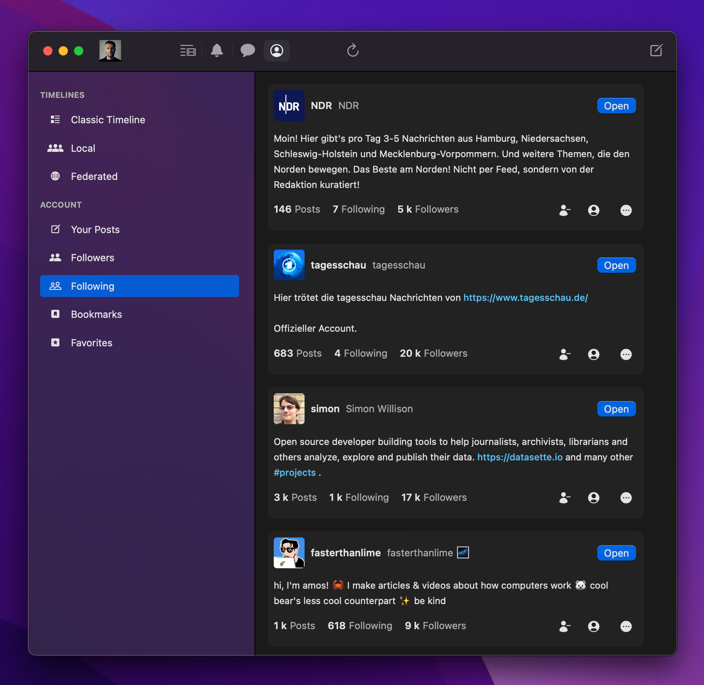
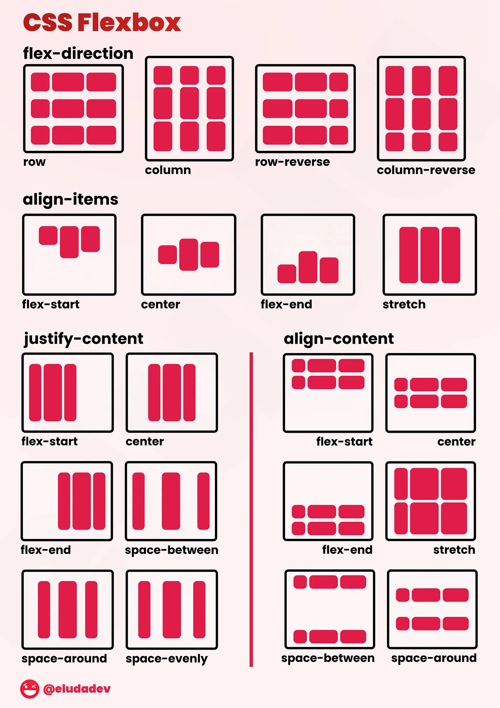
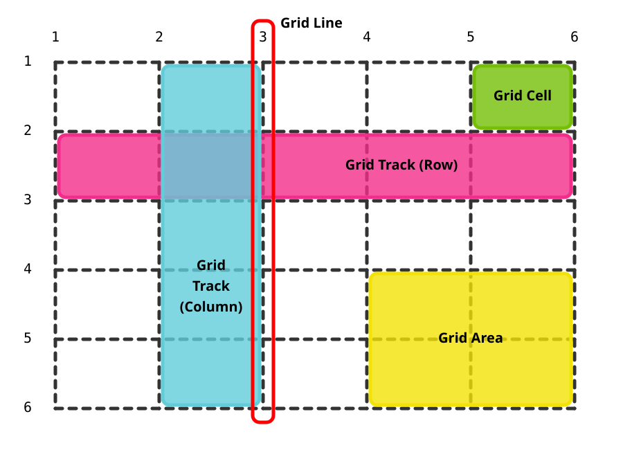

# 为您的应用进行样式设计

Dioxus 使用标准的 HTML 和 CSS 进行样式设计，因此您可以轻松地利用现有的 CSS 框架、库和相关知识。本章将介绍多种为 Dioxus 应用程序进行样式设计的途径，从内联样式到 TailwindCSS 等 CSS 框架。

## Dioxus 使用 CSS 进行样式设计

与其他许多引入自己样式系统的 UI 框架不同，Dioxus 采用了 Web 原生的样式方法：HTML 和 CSS。这意味着您可以继续使用所有您已经熟悉并喜爱的 CSS 知识、工具和框架。

CSS 是迄今为止最受欢迎的样式系统，功能极其强大。例如，这里是一张由 Dioxus 构建的非常漂亮的 Mastodon 客户端 [Ebou](https://github.com/terhechte/Ebou) 的截图。



所有第一方 Dioxus 渲染器都采用 CSS，但其他渲染器（如 [Freya](http://freyaui.dev/)）可能会使用自己的样式系统。Dioxus 会在适用时自动将您的 CSS 转换为相应的原生小部件属性，不过在某些情况下，您可能需要编写特定于平台的代码，以实现理想的原生外观和感觉。

## 内联 CSS（Inline CSS）

向元素添加样式最简单的方法是通过 HTML 的 [`style`](https://developer.mozilla.org/en-US/docs/Web/HTML/Reference/Global_attributes/style) 属性使用内联 CSS。只需将您的 CSS 样式写成内联字符串即可：

```rust
use dioxus::prelude::*;

fn App() -> Element {
    rsx! {
        div {
            style: "background-color: blue; color: white; padding: 20px; border-radius: 8px;",
            "这是一个带样式的 div！"
        }
    }
}
```

为了提升易用性，Dioxus 还允许您直接将单个 CSS 属性作为属性设置。CSS 属性名通过其 `snake_case` 变体来引用：

```rust
fn App() -> Element {
    rsx! {
        div {
            background_color: "blue",
            color: "white",
            padding: "20px",
            border_radius: "8px",
            "这是一个带样式的 div！"
        }
    }
}
```

由于 CSS 属性是属性，您可以通过使用 Rust 表达式使它们动态化：

```rust
fn App() -> Element {
    let mut is_dark = use_signal(|| false);

    rsx! {
        div {
            background_color: if is_dark() { "black" } else { "white" },
            color: if is_dark() { "white" } else { "black" },
            padding: "20px",
            onclick: move |_| is_dark.toggle(),
            "点击切换主题"
        }
    }
}
```

## 样式表（Stylesheets）

对于较大的应用程序，最好将样式组织在单独的 CSS 文件中。Dioxus 通过 `asset!()` 宏为 CSS 样式表提供了出色的支持。

### 包含 CSS 文件

在您的 `assets` 目录中创建一个 CSS 文件，并使用 `asset!()` 宏将其包含进来。Dioxus 提供了两种"文档"元素——`document::Link` 和 `document::Stylesheet`：

```rust
use dioxus::prelude::*;

// 定义 CSS 资产
static MAIN_CSS: Asset = asset!("/assets/main.css");

fn App() -> Element {
    rsx! {
        // 将样式表包含在文档头部
        document::Stylesheet { href: MAIN_CSS }
        div {
            class: "my-component",
            "你好，带样式的世界！"
        }
    }
}
```

请注意，普通的 `link` 元素也可以工作，不过在与服务器端渲染一起使用时，它不会被标记为可预加载：

```rust
rsx! {
    link { href: asset!("/assets/main.css") }
}
```

您的 `assets/main.css` 文件可能如下所示：

```css
.my-component {
    background-color: #f0f9ff;
    border: 2px solid #0ea5e9;
    border-radius: 8px;
    padding: 16px;
    font-family: system-ui, sans-serif;
}

.my-component:hover {
    background-color: #e0f2fe;
    transform: translateY(-2px);
    transition: all 0.2s ease;
}
```

### CSS 选择器

要使用样式表中的样式声明，我们可以使用[类选择器](https://developer.mozilla.org/en-US/docs/Web/CSS/Class_selectors)和 [ID 选择器](https://developer.mozilla.org/en-US/docs/Web/CSS/ID_selectors)：

```css
.my-component {
    background-color: #f0f9ff;
}

#root-component {
    font-weight: 500;
}
```

```rust
rsx! {
    div {
        id: "root-component",
        class: "my-component",
    }
}
```

CSS 提供了多种选择器，您可以在样式表中加以利用：

- [**元素选择器**](https://developer.mozilla.org/en-US/docs/Web/CSS/Type_selectors)（`div`、`p`、`h1`）：按标签名定位 HTML 元素
- [**类选择器**](https://developer.mozilla.org/en-US/docs/Web/CSS/Class_selectors)（`.my-class`）：定位具有特定 class 属性的元素
- [**ID 选择器**](https://developer.mozilla.org/en-US/docs/Web/CSS/ID_selectors)（`#my-id`）：定位具有特定 ID 属性的单个元素
- [**属性选择器**](https://developer.mozilla.org/en-US/docs/Web/CSS/Attribute_selectors)（`[type="text"]`）：根据属性定位元素
- [**后代选择器**](https://developer.mozilla.org/en-US/docs/Web/CSS/Descendant_combinator)（`div p`）：定位另一个元素的后代元素
- [**子元素选择器**](https://developer.mozilla.org/en-US/docs/Web/CSS/Child_combinator)（`div > p`）：定位元素的直接子元素
- [**相邻兄弟选择器**](https://developer.mozilla.org/en-US/docs/Web/CSS/Next-sibling_combinator)（`h1 + p`）：定位紧接在另一个元素之后的元素
- [**一般兄弟选择器**](https://developer.mozilla.org/en-US/docs/Web/CSS/Subsequent-sibling_combinator)（`h1 ~ p`）：定位另一个元素的兄弟元素
- [**伪类选择器**](https://developer.mozilla.org/en-US/docs/Web/CSS/Pseudo-classes)（`:hover`、`:focus`、`:nth-child()`）：定位处于特定状态的元素
- [**伪元素选择器**](https://developer.mozilla.org/en-US/docs/Web/CSS/Pseudo-elements)（`::before`、`::after`）：定位虚拟元素或元素的部分
- [**通用选择器**](https://developer.mozilla.org/en-US/docs/Web/CSS/Universal_selectors)（`*`）：定位所有元素
- [**分组选择器**](https://developer.mozilla.org/en-US/docs/Web/CSS/Selector_list)（`h1, h2, h3`）：同时对多个选择器应用样式

### 使用类实现条件样式

HTML 的 [`class`](https://developer.mozilla.org/en-US/docs/Web/HTML/Reference/Global_attributes/class) 属性支持条件样式，并且可以在同一个元素上多次定义：

```rust
fn App() -> Element {
    let mut is_active = use_signal(|| false);
    let mut is_large = use_signal(|| false);

    rsx! {
        button {
            class: "btn",
            class: if is_active() { "btn-active" },
            class: if is_large() { "btn-large" },
            onclick: move |_| is_active.toggle(),
            "切换我！"
        }
    }
}
```

在 HTML 中，`class` 属性指定了某个元素所具有的 CSS 类列表。对应的 CSS 样式表可能会包含您的元素所使用的多个类：

```css
/* 按钮的基础 btn 类 */
.btn {
    background-color: #f3f4f6;
    border: 1px solid #d1d5db;
    border-radius: 6px;
    padding: 8px 16px;
    font-size: 14px;
    font-weight: 500;
    cursor: pointer;
    transition: all 0.2s ease;
}

/* 当 is_active() 为 true 时添加的 "active" 类 */
.btn-active {
    background-color: #3b82f6;
    color: white;
    border-color: #2563eb;
}

/* 当 is_large() 为 true 时添加的 "large" 类 */
.btn-large {
    padding: 12px 24px;
    font-size: 16px;
}
```

## CSS 自定义属性用于主题设计（CSS Custom Properties for Theming）

您可以使用 CSS 自定义属性（变量）来实现一致的主题设计。这通常比使用 Rust 变量更受推荐，因为动态字符串格式化可能效率较低且更难优化。

```css
:root {
    --color-primary: #3b82f6;
    --color-primary-hover: #2563eb;
    --color-text: #1f2937;
    --color-background: #ffffff;
    --border-radius: 6px;
    --spacing-xs: 4px;
    --spacing-sm: 8px;
    --spacing-md: 16px;
    --spacing-lg: 24px;
}

.button {
    background: var(--color-primary);
    color: var(--color-background);
    padding: var(--spacing-sm) var(--spacing-md);
    border-radius: var(--border-radius);
    border: none;
    cursor: pointer;
}

.button:hover {
    background: var(--color-primary-hover);
}
```

## SCSS

Dioxus 开箱即支持 SCSS (Sass) 文件。只需将 `asset!()` 宏与 `.scss` 文件一起使用：

```rust
static STYLES: Asset = asset!("/assets/styles.scss");
```

您的 `assets/styles.scss` 文件可以使用所有 SCSS 特性：

```scss
$primary-color: #3b82f6;
$secondary-color: #64748b;
$border-radius: 8px;

.card {
    background: white;
    border-radius: $border-radius;
    box-shadow: 0 1px 3px rgba(0, 0, 0, 0.1);

    &:hover {
        box-shadow: 0 4px 6px rgba(0, 0, 0, 0.1);
    }

    .header {
        background: $primary-color;
        color: white;
        padding: 16px;
        border-radius: $border-radius $border-radius 0 0;
    }

    .content {
        padding: 16px;
        color: $secondary-color;
    }
}
```

## Tailwind

[Tailwind CSS](https://tailwindcss.com/) 是一种流行的实用优先的 CSS 框架，与 Dioxus 配合得非常好。它允许您使用预定义的实用类为元素设置样式。这个文档网站本身也使用了 Tailwind！我们只需在 Dioxus 中使用 tailwind 类即可：

```rust
rsx! {
    div { class: "flex flex-col items-center p-7 rounded-2xl" },
        img { class: "size-48 shadow-xl rounded-md", src: "/img/cover.png" },
        div { class: "flex" },
            span { "Class Warfare" },
            span { "The Anti-Patterns" },
            span { class: "flex" },
                span { "No. 4" },
                span { "·" },
                span { "2025" },
            },
        },
    }
}
```

截至 Dioxus 0.7，DX 会自动为您下载并启动一个 TailwindCSS 监听器。每当您使用 DX 构建项目时，Tailwind CLI 会收集您的类，并生成一个输出文件到 `assets/tailwind.css`。

如果在项目的根目录下找到名为 `tailwind.css` 的文件，DX 会自动检测您的项目正在使用 TailwindCSS。在这个文件中，您声明一个基本的 Tailwind 导入，以及一行额外的代码，确保监听器能够搜索 Rust 文件：

```css
@import "tailwindcss";
@source "./src/**/*.{rs,html,css}";
```

请注意，我们需要将生成的样式表添加到我们的应用中：

```rust
fn app() -> Element {
    rsx! {
        document::Stylesheet { href: asset!("/assets/tailwind.css") }
    }
}
```

Tailwind 提供了许多[主题变量](https://tailwindcss.com/docs/theme)可供配置，我们可以通过更新 `tailwind.css` 文件来实现。例如，我们可以自定义文档的字体，或者定义自定义颜色方案。

```css
@theme {
    --color-dxblue: #00A8D6;
    --color-ghmetal: #24292f;
    --color-ghdarkmetal: #161b22;
    --color-ideblack: #0e1116;
    --font-sans: "Inter var", sans-serif;
}
```

Tailwind 与 Dioxus 的多 class 属性支持配合良好：

```rust
fn Card() -> Element {
    let mut is_hovered = use_signal(|| false);

    rsx! {
        div {
            class: "bg-white rounded-lg shadow-md p-6 m-4",
            class: if is_hovered() { "shadow-xl transform -translate-y-1" },
            class: "transition-all duration-200",

            onmouseenter: move |_| is_hovered.set(true),
            onmouseleave: move |_| is_hovered.set(false),

            h2 { class: "text-xl font-bold text-gray-800 mb-2" },
                "卡片标题",
            p { class: "text-gray-600" },
                "这是一个用 Tailwind CSS 样式的精美卡片组件。"
        }
    }
}
```

### VSCode 集成

为了获得更好的 Tailwind 开发体验，请安装 Tailwind CSS IntelliSense 扩展，并将以下内容添加到您的 VSCode 设置中：

```json
{
    "tailwindCSS.experimental.classRegex": ["class: \"(.*)\""],
    "tailwindCSS.includeLanguages": {
        "rust": "html"
    }
}
```

## 布局元素

如果您熟悉 HTML 和 CSS，那么您很可能已经知道如何排列 HTML 元素来构建所需的 UI。不过，如果您刚刚接触 HTML 和 CSS，那么了解多种在页面上布局元素的方法还是很有价值的。CSS 同时支持多种布局系统：

- **正常流**：默认布局方式，元素垂直堆叠（块级元素）或水平流动（行内元素）
- **Flexbox**：一维布局系统，用于以灵活的尺寸和对齐方式排列行或列中的元素
- **CSS Grid**：二维布局系统，用于创建包括行和列的复杂网格布局
- **浮动**：旧版布局方法，可将元素左移或右移，让文本环绕它们
- **定位**：允许使用 `static`、`relative`、`absolute`、`fixed` 或 `sticky` 定位精确控制元素位置
- **表格布局**：将元素显示为表格单元格、行和列（可通过 `display: table` 对非表格元素使用）
- **多列**：将内容分割成多个列，类似于报纸布局

一般来说，您会使用 Flexbox 或 CSS Grid。

### Flexbox 布局

Flexbox 在构建响应式用户界面时非常方便。当您调整文档视口时，元素会自动调整其大小和位置，以适应其 flex 约束。[CSS-Tricks 指南](https://css-tricks.com/snippets/css/a-guide-to-flexbox/) 提供了一个非常有用的教程，介绍了您可以使用的各种 flex 约束。



### CSS Grid

CSS Grid 是另一种强大的布局系统。您可以利用 CSS 样式表声明文档的命名区域，沿固定或灵活的网格线划分这些区域。目前有许多在线工具提供了[图形界面](https://grid.layoutit.com/)，帮助您构建网格布局。

### 固定定位布局



有时您需要使用[固定定位布局](https://developer.mozilla.org/en-US/docs/Web/CSS/position)。这种布局的灵活性不如 CSS Grid 和 Flexbox，但它可以实现诸如粘性头部和动态定位内容等功能。

## 图标和 SVG

Dioxus 支持多种方法在您的应用程序中包含图标和 SVG 图形。

### 内联 SVG

您可以直接在 RSX 中包含 SVG：

```rust
fn IconButton() -> Element {
    rsx! {
        button {
            class: "flex items-center gap-2 px-4 py-2 bg-blue-500 text-white rounded",

            // 内联 SVG 图标
            svg {
                width: "16",
                height: "16",
                viewBox: "0 0 24 24",
                fill: "currentColor",
                path {
                    d: "M12 2l3.09 6.26L22 9.27l-5 4.87 1.18 6.88L12 17.77l-6.18 3.25L7 14.14 2 9.27l6.91-1.01L12 2z"
                }
            },

            "星"
        }
    }
}
```

### SVG 资产

对于较大或可复用的 SVG 文件，您可以将其存储在单独的文件中，并使用 `asset!()` 宏导入。

```rust
fn Icon() -> Element {
    rsx! {
        img {
            src: asset!("/assets/logo.svg"),
            alt: "Logo",
            class: "h-8 w-8"
        }
    }
}
```

### 图标库

您还可以使用提供图标集合的 Rust crate。目前有几个库可用：

- [**Dioxus Free Icons**](https://crates.io/crates/dioxus-free-icons) — 适用于 Dioxus 的 FreeIcons 库
- [**Dioxus Material Icons**](https://crates.io/crates/dioxus-material-icons) — Google 的 Material Icons 库，适用于 Dioxus
- [**Dioxus Hero Icons**](https://crates.io/crates/dioxus-heroicons) — HeroIcons 库，适用于 Dioxus

```rust
use dioxus_free_icons::{Icon, icons::fa_solid_icons};

fn App() -> Element {
    rsx! {
        Icon {
            width: 30,
            height: 30,
            fill: "blue",
            icon: fa_solid_icons::FaHeart
        }
    }
}
```

### 使用 dangerous_inner_html

如果您想从原始 HTML 表示中包含图标，可以使用 `dangerous_inner_html`，它会从 Rust 字符串设置内容：

```rust
rsx! {
    svg { dangerous_inner_html: r#"<path d=\"M256 352 128 160h256z\" />"# }
}
