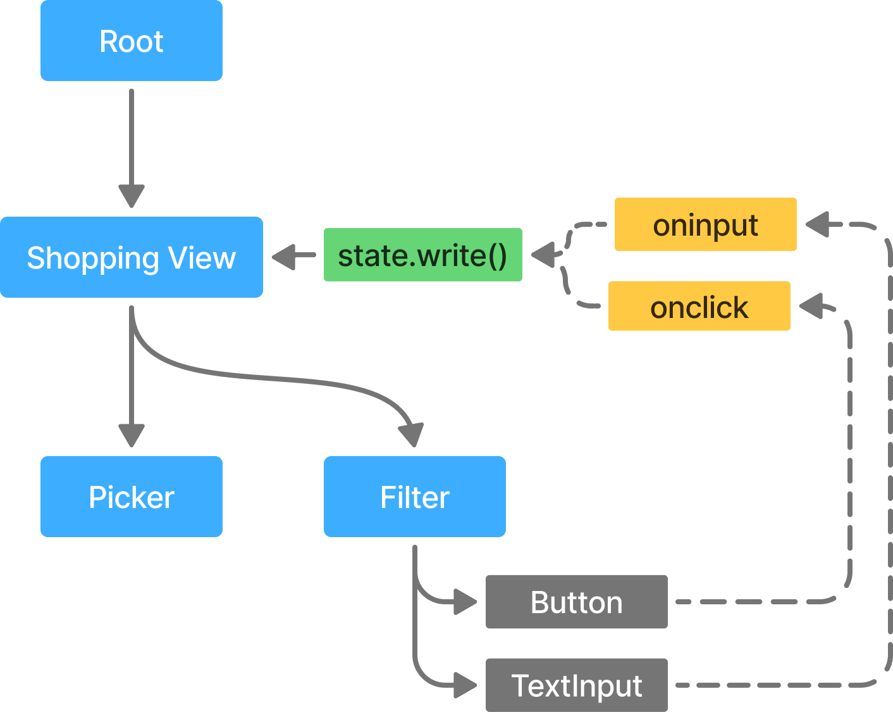

# 反应性的入门

到目前为止，我们已经介绍了如何使用 RSX 声明静态用户界面。现在，是时候让我们的 UI 变得交互起来了。当用户点击按钮、移动光标或输入文本时，我们希望 UI 能够做出相应的更新。

对状态变化作出反应的行为被称为"反应性"。反应性是 Dioxus 的核心所在。从数据获取到路由导航，所有的一切都围绕着对状态变化的反应展开。

与 ReactJS 等库类似，Dioxus 提供了一个内置的反应性系统，让你无需手动排队组件的重新渲染。如果你之前从事过 Web 开发，这种感觉应该会很熟悉。但如果你主要习惯于即时模式的 GUI，那么这可能会显得有些陌生。

反应性系统能够支持更大、更模块化、更复杂的 GUI，这是其他方法通常难以实现的。为了构建能有效利用反应性的 UI，我们需要遵循三大支柱：

1. **数据单向流动**：我们的应用保持一种从父组件到子组件的单向数据流。
2. **数据被追踪**：对数据的修改会被反应式作用域和副作用所观察。
3. **数据被派生**：我们的 UI 和状态完全由数据源决定。

## 支柱一：数据单向流动

反应性的第一个基本支柱：数据单向流动。随着应用规模的增长，其复杂度也会随之增加。在拥有数十个屏幕和数百个组件的应用中，要理清父子元素之间的关系可能会变得困难。通过强制应用中的数据单向流动，我们可以确保子组件的渲染完全依赖于它的输入参数。

为了让我们的应用具备交互性，我们遵循类似的模式。组件提供两类内容：*值*和用于修改这些值的*函数*。这些内容以属性的形式"向下"传递到组件树中。Dioxus 并不提供让子组件"向上"访问并修改父组件状态的方式。

我们向下传递的函数可以自由地在当前组件内修改状态。然而，子组件无法直接修改其父组件的状态。这确保了所有对状态的修改都定义在**与状态本身相同的范围内**，从而让我们更容易大规模地理解和管理应用的状态。



## 支柱二：数据被追踪

反应性的第二个基本支柱：数据被追踪。当你在 Dioxus 中使用各种状态原语时，Dioxus 运行时会**追踪**底层值的变化。每当你对一个*反应式值*调用 `.set()` 或 `.write()` 时，这一操作都会被**观察**，相关的**副作用**也会被执行。

Dioxus 中最核心的反应式值是 Signal。当 Signal 被用在**反应式上下文**中时，它所关联的**读取**和**写入**操作都会被追踪。每个组件本身就是一个反应式上下文。每当 Signal 的值被修改时，一个**副作用**会被加入队列，从而重新运行所有读取该 Signal 值的反应式上下文。

许多 Hook 也利用反应式上下文来附加它们自己的副作用。

## 支柱三：数据被派生

反应性的第三个基本支柱：值是**派生的**。当应用中的任何状态发生变化后，我们希望 UI 能够匹配我们在 RSX 中所声明的内容。在这种情况下，UI 就是从应用状态中**派生**出来的。同样，在反应式编程中，所有数据要么是数据源，要么是从某个数据源**派生**而来的。

因此，在渲染组件时，我们更倾向于在渲染过程中或通过 memo 来执行数据的转换。我们**不会**在渲染过程中直接修改数据。

```rust
// ✅ *num_names* 由 "names" 派生而来；
let names = use_signal(|| vec!["Jane", "Jack", "Jill"]);
let num_names = names.read().len();

// ❌ 我们不会将 num_names 存储在信号中
let names = use_signal(|| vec!["Jane", "Jack", "Jill"]);
let mut num_names = use_signal(|| 0);
num_names.set(names.read().len());
```

希望你已经明白，数据应当是**派生**的这一点。如果我们试图在渲染过程中修改组件状态，就可能无意中触发重新渲染的副作用，从而导致无限循环。
