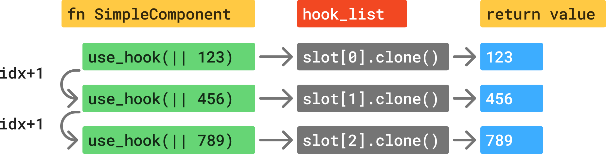

# 钩子（Hooks）

在 Dioxus 中，组件本地的状态存储在钩子（hooks）中。

Dioxus 的钩子与 React 的钩子工作方式类似。如果你之前没有做过太多 Web 开发，钩子可能会显得特别陌生。钩子提供了一种存储状态并为组件添加效果组合能力的方式。更棒的是，它们比声明结构体和实现 "render" 特质要简洁得多！

## use_hook 原语

Dioxus 中的所有钩子都是基于 `use_hook` 原语构建的。虽然你可能永远不会直接使用这个原语，但了解所有状态最终都存放在哪里还是很有帮助的。`use_hook` 原语是一个函数，它接受一个初始化器，并返回该值的一个克隆。

```rust
fn Simple() -> Element {
    let count = use_hook(|| 123);
    rsx! { "{count}" }
}
```

每次调用 `use_hook` 时，会发生以下两种情况之一：

- 如果这个 `use_hook` 此前从未被调用过，就会运行初始化器并创建一个新的槽位
- 否则，`use_hook` 会返回当前槽位中值的克隆

在内部，"钩子索引"（hook index）会在每次调用 `use_hook` 时递增 1，并在组件重新渲染前重置为 0。



## 钩子规则

在 Dioxus 中，我们对框架的内部运作是透明的。由于钩子是通过遍历内部的"钩子列表"（hook list）来实现的，因此它们有一些特定的规则，如果违反这些规则，就可能导致遍历失败，进而使你的应用出现恐慌（panic）。需要注意的是，这些规则并非随意制定——它们正是钩子实现方式的必然结果。

钩子利用调用顺序来追踪每个钩子对应的状态。你必须在每次组件运行时以相同的顺序调用钩子。为了确保顺序始终一致，你应该只在组件的顶层或另一个钩子的顶层调用钩子。

这些规则意味着，有些事情是你不能用钩子完成的：

### 条件语句中禁止使用钩子

你不应有条件地调用钩子函数。当组件重新渲染时，这可能导致钩子列表跳过某个条目，从而使得下一个钩子获取到错误的值。

```rust
// ❌ 不要在条件语句中调用钩子！
// 我们必须确保每次都会调用相同的钩子
// 但 `if` 语句只有在条件为真时才会运行！
// 所以我们可能会违反规则 2。
if you_are_happy && you_know_it {
    let something = use_signal(|| "hands");
    println!("clap your {something}")
}

// ✅ 相反，总是调用 use_signal
// 你可以把其他东西放在条件中
let something = use_signal(|| "hands");
if you_are_happy && you_know_it {
    println!("clap your {something}")
}
```

### 闭包中禁止使用钩子

与条件语句类似，闭包也提供了让钩子函数在不同渲染之间以不一致的顺序调用的可能性。与其把钩子放在闭包里，不如只在闭包中使用钩子函数的结果。

```rust
// ❌ 不要在闭包中使用钩子！
// 我们无法保证闭包，如果被调用，每次都会以相同的顺序运行
let _a = || {
    let b = use_signal(|| 0);
    b()
};

// ✅ 相反，把钩子 `b` 移到外面
let b = use_signal(|| 0);
let _a = || b();
```

### 循环中禁止使用钩子

和条件语句及闭包一样，在循环中调用钩子函数也可能导致不同渲染之间钩子值的获取不一致，从而引发钩子返回错误的值。

```rust
// `names` 是一个 Vec<&str>;

// ❌ 不要在循环中使用钩子！
// 在这种情况下，如果 Vec 的长度改变，我们会违反规则 2
for _name in names {
    let is_selected = use_signal(|| false);
    println!("selected: {is_selected}");
}

// ✅ 相反，使用带有 use_signal 的 hashmap
let selection_map = use_signal(HashMap::<&str, bool>::new);

for name in names {
    let is_selected = selection_map.read()[name];
    println!("selected: {is_selected}");
}
```

### 提前返回

与 React 不同，在 Dioxus 中，你可以在钩子调用之间提前返回。不过，我们通常不建议采用这种模式，因为它可能会导致与条件语句类似的不一致性问题。Dioxus 支持提前返回，是因为错误边界（error boundaries）和 Suspense 边界采用了问号（`?`）语法，以提升开发体验。

```rust
let name = use_signal(|| "bob".to_string());

// ❌ 不要在钩子之间提前返回！
if name() == "jack" {
    return Err("wrong name".into())
}

let age = use_signal(|| 123);

rsx! { "{name}, {age}" }

// ✅ 相反，倾向于在所有钩子函数运行完之后再提前返回
let name = use_signal(|| "bob".to_string());
let age = use_signal(|| 123);

if name() == "jack" {
    return Err("wrong name".into())
}

rsx! { "{name}, {age}" }
```

### 钩子名称需以 "use_" 开头

按照惯例，钩子都是带有 `use_` 前缀的 Rust 函数。当你看到一个带有 `use_` 前缀的函数时，就应该意识到，它内部会遍历组件的钩子列表，因此必须遵守钩子规则。

## 为什么使用钩子？

你可能会问：为什么要用钩子呢？难道结构体和特质还不够吗？

钩子之所以有用，是因为它们具有极佳的组合性。我们可以将钩子原语组合起来，构建出复杂而模块化的交互，同时保持接口的一致性。只需一个函数，我们就能同时封装状态和效果。

```rust
// 这个钩子是从初始化器派生出来的
fn use_document_title(initial: impl FnOnce() -> String) -> Signal<String> {
    let mut title = use_signal(initial);

    // 每当 title 信号变化时，我们排队一个副作用来修改窗口状态
    use_effect(move || {
        window().document().set_title(title());
    });

    // 我们返回响应式的 String
    title
}
```

钩子的另一个优势是：我们无需像基于结构体的方法那样声明大量样板代码。一个简单的组件，用来存储用户名和电子邮件，用钩子实现起来非常简单：

```rust
#[component]
fn Card(default_name: String) -> Element {
    let mut name = use_signal(|| default_name);
    let mut email = use_signal(|| "".to_string());
    rsx! {
        span { "default: {default_name}" }
        input { oninput: move |e| name.set(e.value()), }
        input { oninput: move |e| email.set(e.value()), }
    }
}
```

而结构体组件可能会相当冗长：

```rust
struct Card {
    default_name: String
    name: Signal<String>,
    email: Signal<String>,
}

#[derive(PartialEq, Clone)]
struct CardProps {
    default_name: String
}

impl Component for Card {
    type Props = CardProps;

    fn new(props: Self::Props) -> Self {
        Self {
            name: Signal::new(props.default_name)
            email: Signal::new("".to_string())
        }
    }

    fn change(&mut self, props: Self::Props) {
        self.default_name = props.default_name;
    }

    fn render(&mut self, state: Handle<Self>) -> Element {
        rsx! {
            span { "default: {self.default_name}" }
            input { oninput: move |e| state.name.set(e.value()) }
            input { oninput: move |e| state.email.set(e.value()) }
        }
    }
}
```

通过单个函数，我们就能够表达一个值初始化器、建立自动值追踪，并处理对组件属性的变更。我们可以轻松地封装共享行为、排队副作用，并组合模块化的原语。
