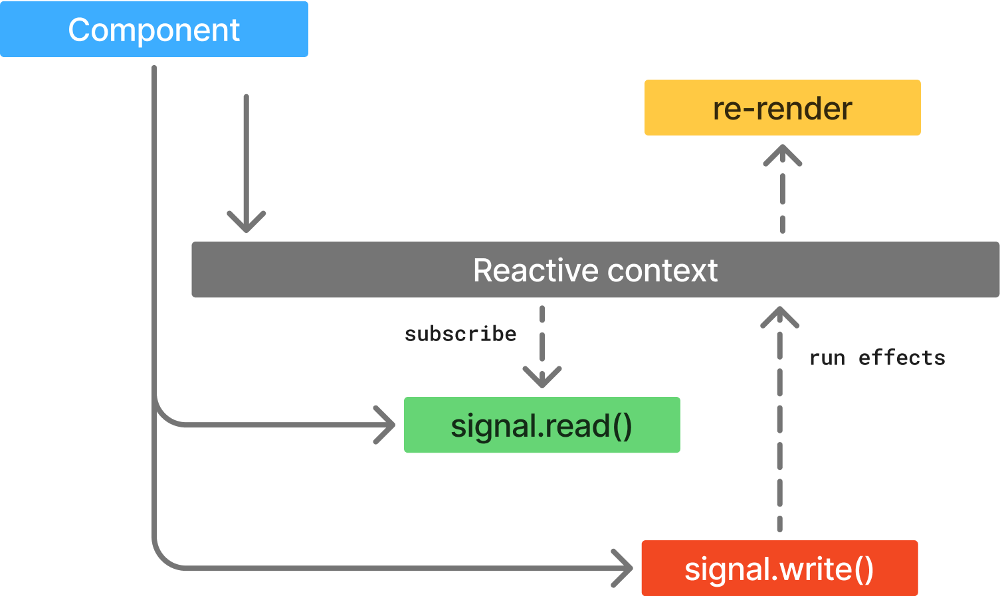
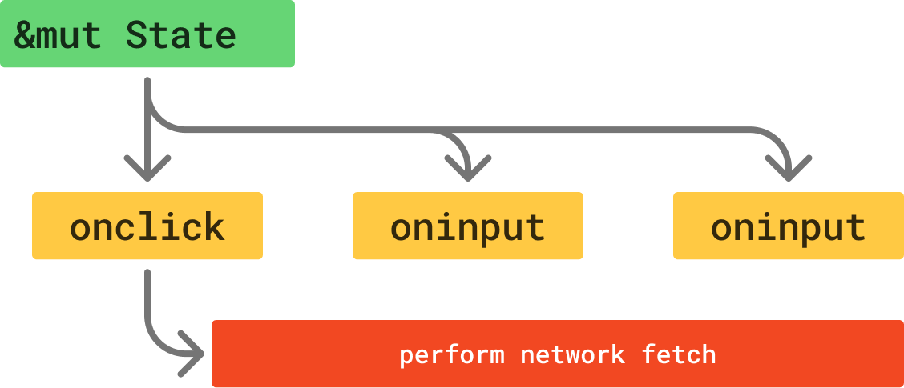
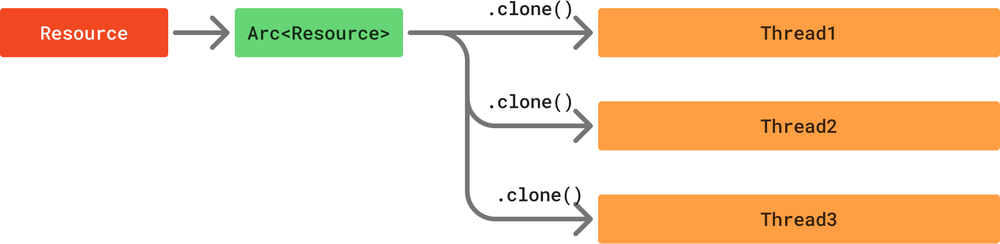
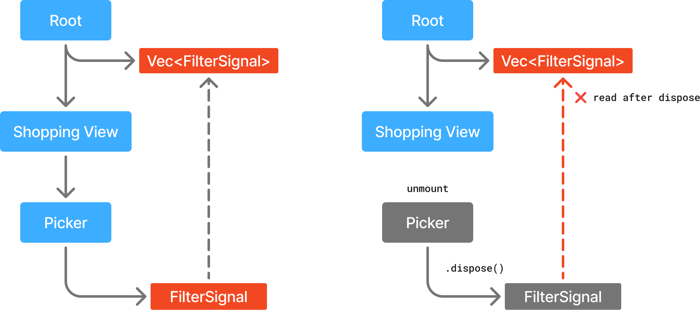

# 响应式信号

在 Dioxus 中，应用的 UI 被定义为当前状态的函数。当状态发生变化时，依赖于该状态的组件和效果会自动重新运行。响应式机制会自动**跟踪**状态并**推导**出新的状态，从而轻松构建高效且易于理解的大型应用。

Dioxus 提供了一个可变状态的单一来源：**Signal**。

## 使用信号管理状态

在 Dioxus 中，可变状态存储在 Signal 中。Signal 是受**跟踪**的值，它们会自动更新关注它们的**响应式上下文**。它们是所有其他状态的源头。Signal 由事件处理器直接修改，以响应用户输入，或在 Future 中异步更新。

你可以使用 `use_signal` 钩子创建一个 Signal：

```rust
let mut signal = use_signal(|| 0);
```

一旦你有了 Signal，你可以通过调用 `.read()` 获取其内部值的引用：

```rust
let signal = use_signal(|| 0);

// 使用 `.read()` 访问内部值
let inner = signal.read();
```

对于内部值可以廉价克隆的 Signal，你还可以使用"函数"语法直接获取值的 `Clone` 版本。

```rust
let name = use_signal(|| "Bob".to_string());

// 将 Signal 当作函数调用
let inner = name();

// 或者使用 `.cloned()`
let inner = name.cloned();
```

最后，你可以通过 `.set()` 方法设置 Signal 的值，或者通过 `.write()` 方法获取内部值的可变引用：

```rust
// 通过 Signal 设置值
signal.set(1);

// 通过 `.write()` 方法获取内部值的可变引用
let mut value: &mut i32 = &mut signal.write();
*value += 1;
```

一个简单组件使用 `.read()` 和 `.write()` 来更新自身状态的例子可能如下：

```rust
fn Demo() -> Element {
    let mut count = use_signal(|| 0);

    // 读取当前值
    let current = count.read().clone();

    rsx! {
        button {
            onclick: move |_| *count.write() = current,
            "Increment ({current})"
        }
    }
}
```

在给 `.write()` 调用赋值时，请注意我们使用了[**解引用操作符**](https://doc.rust-lang.org/std/ops/trait.DerefMut.html)，这让我们可以直接将值写入可变引用。

## 信号上的便捷方法

在某些情况下，将数据包装在 Signal 中可能会让访问内部状态变得麻烦。可变 Signal 实现了两个基本 Trait：`Readable` 和 `Writable`。这些 Trait 提供了一系列自动的便捷改进。

- `Signal<T>` 如果 `T` 实现了 `Display`，则实现 `Display`
- `Signal<bool>` 实现了 `fn toggle()`
- `Signal<i32>` 和其他数字类型实现了数学运算符（+、-、/等）
- `Signal<T>` 其中 `T` 实现了 `IntoIterator`，则实现 `.iter()`

- 以及更多！

`Display` 扩展使得可以在格式化表达式中使用 Signal：

```rust
let mut count = use_signal(|| 0);

rsx! { "Count is: {count}" }
```

`toggle` 扩展让布尔值的切换更简单：

```rust
let mut enabled = use_signal(|| true);

rsx! {
    button {
        onclick: move |_| enabled.toggle(),
        if enabled() { "disable" } else { "enable" }
    }
}
```

数学运算符简化了算术操作：

```rust
fn app() -> Element {
    let mut count = use_signal(|| 0);

    rsx! {
        h1 { "High-Five counter: {count}" }
        button { onclick: move |_| count += 1, "Up high!" }
        button { onclick: move |_| count -= 1, "Down low!" }
    }
}
```

`iter` 扩展让遍历集合更方便：

```rust
fn app() -> Element {
    let names = use_signal(|| vec!["bob", "bill", "jane", "doe"]);

    rsx! {
        ul {
            for name in names.iter() {
                li { "hello {name}" }
            }
        }
    }
}
```

通常情况下，除非内部状态不实现所需的 Trait，否则你应该优先使用这些扩展方法。这里没有列出的所有方法都可以查阅文档参考以获取更多信息。

## ReadSignal 和 WriteSignal

Dioxus 提供了两种基础 Signal 类型的变体：`ReadSignal` 和 `WriteSignal`。

- **`ReadSignal`**：基础 Signal 类型的只读版本
- **`WriteSignal`**：基础 Signal 类型的读写版本，等同于 `Signal` 本身

ReadSignal 是实现了 `Readable` Trait 的响应式值。WriteSignal 是实现了 `Writable` Trait 的响应式值。

这两种变体在编写需要对输入类型通用的组件时非常有用。如果组件只需要 `.read()` 方法及其扩展，那么它可以将 `ReadSignal` 作为参数指定。

```rust
fn app() -> Element {
    let mut name: Signal<String> = use_signal(|| "abc".to_string());

    rsx! {
        // rsx 宏会自动将 Signal 转换为 ReadSignal
        Name { name }
    }
}

// 我们可以接受任何实现了 `Into<ReadSignal>` 的类型
#[component]
fn Name(name: ReadSignal<String>) {
    rsx! { "{name}" }
}
```

在 Dioxus 中，`Signal` 并不是唯一的响应式类型。整个生态系统充满了自定义的响应式类型。Dioxus 本身也提供了额外的响应式类型，如 `Memo` 和 `Resource`。为了更好地与更广泛的生态系统集成，最好在接口中优先使用 `ReadSignal` 和 `WriteSignal`，而不是具体的响应式类型。

这样可以确保我们可以同时将 `Signal` 和 `Memo` 传递给同一个函数：

```rust
let name: Signal<String> = use_signal(|| "abc".to_string());
let uppercase: Memo<String> = use_memo(move || name.to_uppercase());

rsx! {
    // rsx 宏会自动将 Signal 转换为 ReadSignal
    Name { name, uppercase }
    // rsx 宏会自动将 Memo 转换为 ReadSignal
    Name { uppercase }
}

#[component]
fn Name(name: ReadSignal<String>, uppercase: Memo<String>) {
    rsx! { "{name}" }
}
```

## 响应式作用域

**响应式作用域**是一段 Rust 代码块，它会观察响应式值的读取和写入。每当对 Signal 调用 `.write()` 或 `.set()` 时，任何正在跟踪该 Signal 的活跃响应式作用域都会执行回调作为副作用。

最简单的响应式作用域就是一个组件。在组件渲染期间，组件会自动订阅调用了 `.read()` 的信号。`.read()` 方法在许多情况下可以被**隐式**调用——特别是，`Readable` 提供的扩展方法会使用底层的 `.read()` 方法，因此也会贡献到当前的响应式作用域。当信号的值发生变化时，组件会排队一个副作用，使用 `dioxus::core::needs_update` 重新渲染组件。
```rust
let mut name = use_signal(|| "abc".to_string());

rsx! {
    // An explicit call to `.read()`
    {name.read().to_string()}

    // An implicit call via `Display`
    "{name}"
}
```
如果一个组件在渲染时没有调用 Signal 上的 `.read()`，它不会订阅该 Signal 的值。这为我们提供了"零成本响应式"，我们可以自由修改 Signal 值，而无需担心不必要的重新渲染。如果某个值没有被观察，它不会导致不必要的重新渲染。
```rust
let mut loading = use_signal(|| false);

rsx! {
    button {
        // Because we don't use "loading" in our markup, the component won't re-render!
        onclick: move |_| async move {
            if loading() {
                return;
            }
            loading.set(true);
            // .. do async work
            loading.set(false);
        }
    }
}
```

对 `.read()` 的调用会访问当前的响应式作用域，将该作用域添加到 Signal 的订阅者列表中，以便在该 Signal 值变化时运行带有副作用的回调。对于组件，对 Signal 的逻辑会调用一个副作用，以在信号变化时重新渲染组件。



除了组件重新渲染器之外，响应式作用域还有其他用途。像 `use_effect`、`use_memo` 和 `use_resource` 这样的钩子都通过利用响应式作用域来实现功能，这些功能存在于渲染生命周期之外。

### 自动批处理

所有内置钩子都会尽可能批处理更新。与其立即运行副作用，`.write()` 调用会在应用程序的下一个"步骤"之前排队一个副作用。运行时会尝试等待当前步骤中的所有 `.write()` 调用完成后再运行任何效果。这提供了 `.write()` 调用的自动批处理，这对于性能和 UI 的一致性都至关重要。

通过批处理 `.write()` 调用，Dioxus 确保我们的示例 UI 始终显示两种状态之一：

- **"loading?: false -> Complete"**
- **"loading?: true -> Loading"**

```rust
let mut loading = use_signal(|| false);
let mut text = use_signal(|| "Complete!");

rsx! {
    button {
        onclick: move |_| async move {
            // 这些写入被批处理，副作用被去重
            text.set("Loading");
            loading.set(true);

            // 等待 future 允许运行时继续
            do_async_work().await

            // 这些写入也被批处理 - 只排队一次重新渲染
            text.set("Complete!");
            loading.set(false);
        },
        "loading?: {loading:?} -> {text}"
    }
}
```

Dioxus 使用 `await` 边界作为步骤之间的屏障。如果在某个步骤中修改了状态，Dioxus 会优先绘制新 UI，然后再轮询其他 Future。这确保了变化能尽快刷新，不会遗漏待处理的状态。

尽管 Dioxus 尝试批处理写入操作，但在两者冲突时，它更倾向于保持一致的状态而非批处理。如果你在写入依赖的 Signal 后立即读取 Memo 的结果，Memo 会立即重新计算，以确保你得到最新的值。这保证了 Memo 始终等价于直接运行 Memo 的函数。

```rust
let mut count = use_signal(|| 0);
let double = use_memo(|| *count() * 2);

rsx! {
    button {
        onclick: move |_| async move {
            // 这会排队重新计算 Memo，并标记为脏
            count += 1;
            // 这会强制 Memo 立即重新计算
            println!("double is now: {}", double());
        },
        "doubled: {double}"
    }
}
```

## Signal 在运行时被借用

在 Rust 中，`&T` 和 `&mut T` 引用类型会在编译时静态断言底层值是不可变或可变的*在编译时*。这种断言带来了一系列保证，使 Rust 能够生成快速且正确的代码。

不幸的是，这些静态断言并不适合异步后台任务。如果我们的 `onclick` 处理器启动了一个长时间运行的 Future，捕获了 `&mut T`，我们就无法安全地处理任何其他事件，直到这个 Future 完成。



有时，我们的 UI 可能会非常并发。确实有一些方法可以重新调整我们并发访问状态的方式，使其与 Rust 的静态可变性断言兼容——但遗憾的是，这些方法并不容易编程。

相反，Signal 提供了一个 `.write()` 方法，在运行时检查值是否可以安全访问。如果不小心，你可能会在同一作用域中混合使用 `.read()` 和 `.write()`，导致运行时借用失败。

这种情况最常出现在跨 `await` 点持有 `.read()` 或 `.write()` 引用时：

```rust
let mut state = use_signal(|| 0);

rsx! {
    button {
        // 快速点击此按钮会导致多个 `.write()` 调用同时激活
        onclick: move |_| async move {
            let mut writer = state.write();
            sleep(Duration::from_millis(1000)).await;
            *writer = 10;
        }
    }
}
```

幸运的是，这段代码会被 Clippy 检测到错误，因为 `writer` 类型不应该跨 `await` 点持有。

值得庆幸的是，Signal 会防止"简单"情况，因为 `.write()` 方法接受一个 `&mut Signal`。只要 `.write()` 保护在作用域（块）内有效，就不能再持有其他 `.read()` 或 `.write()` 保护：

```rust
let mut state = use_signal(|| 0);

rsx! {
    button {
        // Rust 会阻止这段代码编译，因为 `.write()` 接受 `&mut T`
        onclick: move |_| {
            let cur = state.read();
            *state.write() = *cur + 1;
        }
    }
}
```

我们会从 Rust 编译器那里得到一个非常友好的错误，解释为什么这段代码不能编译：

```rust
error[E0502]: cannot borrow `state` as mutable because it is also borrowed as immutable
 --> examples/readme.rs:22:18
   |
21 |                 let cur = state.read();
   |                           ----- immutable borrow occurs here
22 |                 *state.write() = *cur + 1;
   |                  ^^^^^^^^^ mutable borrow occurs here
23 |             }
   |             - immutable borrow might be used here, when `cur` is dropped and runs its destructor for type `GenerationalRef<Ref<'_, i32>>`
```

如果我们确实想在同一作用域中读写，我们需要按正确的顺序安排操作，使得 `.read()` 和 `.write()` 保护不会重叠。通常，这是通过从 `.read()` 操作派生一个拥有的值，以便在 `.write()` 操作中使用。

```rust
let cur = state.read().clone();
// 调用 `.clone()` 会立即释放 `.read()` 保护。
*state.write() = *cur + 1;
```

请注意，Rust 会在作用域结束时自动丢弃项，除非手动提前丢弃。我们可以使用 `.read()` 保护，前提是它在调用 `.write()` 之前被丢弃。

这可以通过创建一个新的、更短的作用域来访问 `.read()` 保护来实现——

```rust
let next = {
    let cur = state.read();
    println!("{}", cur);
    cur.clone() + 1
};
// 我们可以将 `state` 赋值给 `next`，因为 `next` 不再引用 `.read()`。
*state.write() = next;
```

或者，只需在保护上调用 `drop()`：

```rust
let cur1 = state.read();
let cur2 = *cur1 + 1;
drop(cur1); // 提前丢弃确保我们可以安全地 `.write()` 到 Signal
*state.write() = cur2;
```

## Signal 实现 Copy

如果你用 Rust 开发过其他项目——比如 Web 服务器或命令行工具——你可能遇到过闭包、线程和异步任务的情况，这些都需要 `Arc` 或 `Rc` 来满足借用检查器。



如果你的数据被用于多个并行线程，或者只是保存在回调中，你可能需要将其包装在 `Arc` 或 `Rc` 智能指针中并调用 `.clone()`。这可能导致繁琐的代码，我们需要不断调用 `.clone()` 来共享数据到回调和异步任务。

```rust
let state = Arc::new(123);

// 线程 1
std::thread::spawn({
    let state = state.clone();
    move |_| println!("{:?}", state),
})

// 线程 2
std::thread::spawn({
    let state = state.clone();
    move |_| println!("{:?}", state),
})
```

不幸的是，UI 代码经常遇到这个问题——这就是为什么 Rust 在构建 GUI 应用方面口碑不佳！

为了解决这个问题，我们构建了 [generational-box crate](https://crates.io/crates/generational-box)，它提供了一个 `GenerationalBox` 类型，实现了 [Rust 的 `Copy` trait](https://doc.rust-lang.org/std/marker/trait.Copy.html)。`Copy` Trait 非常重要：Rust 会在作用域边界自动复制 `Copy` 类型（必要时）。

```rust
let state = GenerationalBox::new(123);

// `move` 关键字会自动复制 GenerationalBox！
std::thread::spawn(move | {
    println!("{:?}", state),
    println!("{:?}", state),
});

// 我们可以轻松地跨线程共享，无需 `.clone()` 噪音
std::thread::spawn(move | {
    println!("{:?}", state),
    println!("{:?}", state),
});
```

`GenerationalBox` 类型不是复制底层值，而是简单地复制指向值的"句柄"。这个句柄本质上是一个运行时验证的智能指针。访问 Signal 的内容不如直接读取指针高效——多了一层指针间接和锁——但我们预计大多数代码不会因读取 `GenerationalBox` 内容而成为瓶颈。

Dioxus 的 Signal 直接建立在 `GenerationalBox` 之上。它们共享相同的 `Copy` 语义和便捷性，但也有同样的权衡。

### 自动资源管理

`GenerationalBox` 类型没有自动的 [RAII](https://doc.rust-lang.org/rust-by-example/scope/raii.html) 支持。这意味着当 `GenerationalBox` 被丢弃时，它的资源并不会立即清理。直接使用 `GenerationalBox` 可能会很棘手。Dioxus 通过组件生命周期来管理资源的生命周期，自动清理资源。

当你调用 `use_signal` 时，我们会自动：

- 调用 `Signal::new()`
- 在组件的 `on_drop` 上注册 `signal.dispose()`

每当组件卸载时，它的钩子会被丢弃。当你在组件中创建 Signal 时，每个 Signal 都会注册到该组件的 Signal "所有者"。当组件卸载时，所有者会被丢弃，在它的 `Drop` 实现中，它会调用所有在其作用域中创建的 Signal 的 `.dispose()`。

实际上，我们把 Signal 的 `.dispose()` 方法与组件的卸载关联起来了。

由于 Signal 在组件卸载时被销毁，之后再读取它会导致运行时恐慌。这在实践中很少发生，但如果在树中更高层的组件中"保存"了 Signal，就有可能发生。这样做会违反响应式的单向数据流原则，但从技术上讲是可能的。



在 Signal 被销毁后读取它类似于指针的"使用后自由"错误，但读取 Signal 并不是未定义行为。在调试模式下，Signal 会被提升到它的读者，并在日志中收到警告，提示 Signal 在被销毁后被读取。

类似的问题也可能出现在你直接调用 `Signal::new()` 时。Dioxus 会创建一个隐式的 Signal 所有者，由当前组件拥有。这个 Signal 的内容只有在当前组件卸载时才会被丢弃。调用 `Signal::new()` 可能导致内存无限制增长，直到组件被丢弃。这在正常应用代码中很少见，但在库开发中可能会出现。

```rust
let mut users = use_signal(|| vec![]);

rsx! {
    button {
        // 底层字符串不会被丢弃，直到组件卸载，或你手动调用 `.dispose()`
        onclick: move |_| {
            users.write().push(Signal::new("bob").to_string());
        },
        "Add a new user"
    }
}
```

由于 Signal 在组件卸载时被销毁，之后再读取它会导致运行时恐慌。这在实践中很少发生，但如果在树中更高层的组件中"保存"了 Signal，就有可能发生。这样做会违反响应式的单向数据流原则，但从技术上讲是可能的。

### 最佳实践

在映射 Signal 或动态创建 Signal 时，最好优先使用内置方法和响应式集合。

## 效果、Memo 和其他

Signal 只是 Dioxus 响应式系统的一部分。像 `use_effect` 和 `use_memo` 这样的钩子能够将它们的响应式作用域隔离到仅限于回调和 Future。这意味着这些作用域中的 `.read()` 和 `.write()` 不会在包含它的组件中排队重新渲染的副作用。

我们在[后续章节](/learn/0.7/essentials/basics/effects)中会更深入地介绍这些钩子。
