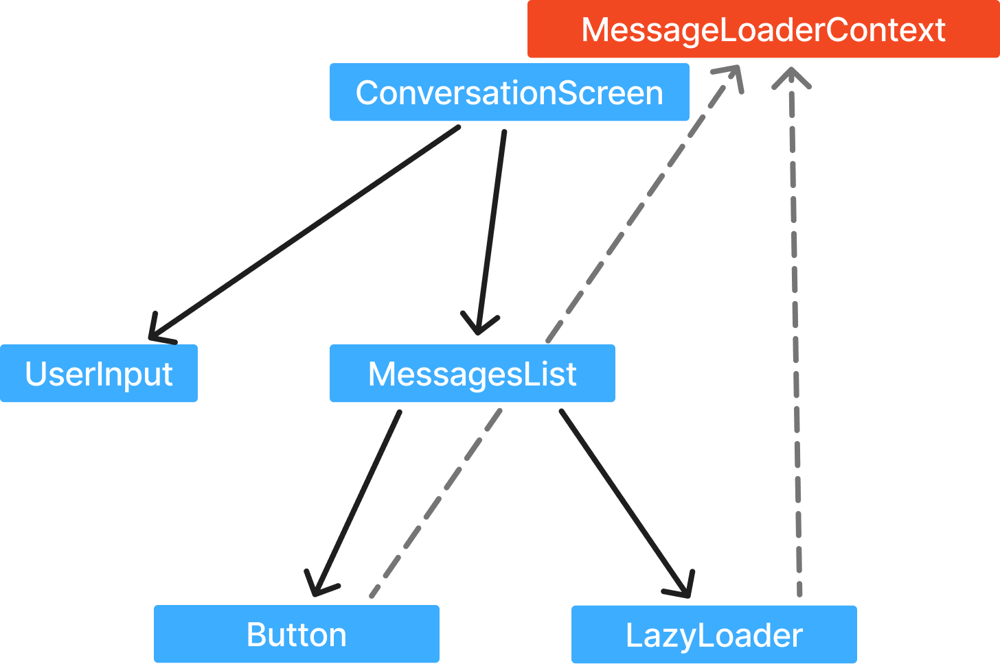

# 全局上下文（Global Context）

到目前为止，你已经掌握了构建大型 Dioxus 应用所需的知识！当你的组件树变得有多层深度时，通过组件属性传递状态会变得繁琐且重复。

通过多层组件属性传递状态的做法被称为"prop drilling"。如果我们能直接从应用根部将 `name` 信号传递给 `Title` 组件，那该多好啊！

这时，全局上下文就派上用场了。组件可以向全局上下文插入值，从而让任何子组件都能"向上"读取这些值。

需要注意的是，上下文只能通过"向上"访问组件树。回想一下响应式编程的一个基本原理：数据是单向流动的。在单向数据流模型中，子组件可以自由地读取父组件的状态。你可以把上下文想象成一种无形的额外参数，它通过每个组件的属性从根组件一直传递到所有子组件。



```rust
fn Child(context: Context, ..props) -> Element { /* */ }
```

上下文大致定义为一个递归的自我定义：

```rust
struct Context {
    contexts: Vec<Rc<dyn Any>>,
    parent: Option<Context>,
}
```

当我们"向上"遍历组件树时，我们首先遍历当前组件的上下文列表，然后递归地检查每个父组件，直到找到目标上下文。

## 提供与消费上下文

在我们开始向上访问组件树之前，首先需要为子组件提供上下文。Dioxus 提供了 `provide_context` 和 `use_context_provider` 函数。通常，你会将状态初始化器放在 `use_context_provider` 钩子中，像这样：

```rust
fn app() -> Element {
    // use_context_provider 接受一个初始化闭包
    use_context_provider(|| "Hello world!".to_string());

    rsx! { Child {} }
}
```

现在，要读取上下文，我们需要将提供者与消费者配对。为此，我们调用 `use_context`，并将返回类型设置为与我们提供的上下文相同的类型。在上面的例子中，我们提供了一个 `String` 类型的对象；因此，我们用 `String` 泛型来消费它：

```rust
fn Child() -> Element {
    let title = use_context::<String>();
    rsx! { "{title}" }
}
```

`::<String>` 语法声明了这次 `use_context` 的返回类型。在 Dioxus 中，上下文对象是按它们的 [TypeId](https://doc.rust-lang.org/std/any/struct.TypeId.html) 索引的。一个类型的 `TypeId` 是一个编译时哈希值，唯一标识每一个 Rust 类型。没有两个类型会共享相同的 `TypeId`，除非它们引用的是同一个底层类型声明——即，[类型别名](https://doc.rust-lang.org/reference/items/type-aliases.html) 会共享相同的 `TypeId`。

当提供上下文对象时，我们应该将想要存储的数据包装在一个自定义类型或 [new type](https://doc.rust-lang.org/rust-by-example/generics/new_types.html) 中。这确保了我们可以在上下文树中存储多个 `String` 对象，并通过它们的包装类型来检索。

声明一个新的类型需要一个新的结构体声明：

```rust
#[derive(Clone)]
struct Title(String);

#[derive(Clone)]
struct Subtitle(String);
```

然后，我们可以使用我们的包装类型来提供上下文：

```rust
use_context_provider(|| Title("Hello world!".to_string()));
use_context_provider(|| Subtitle("Hello world!".to_string()));
```

要消费上下文，我们传入相应的结构体类型：

```rust
let title = use_context::<Title>();
let title = use_context::<Subtitle>();
```

在实践中，你并不需要将状态的每个字段都包装成新类型，通常只需一个结构体来封装一组数据就足够了。

```rust
#[derive(Clone)]
struct HeaderContext {
    title: String,
    subtitle: String,
}
```

然后，我们可以在 RSX 中多次使用这个上下文提供者，但传入不同的参数：

```rust
fn app() -> Element {
    rsx! {
        ThemeProvider {
            color: ThemeColor::Red,
            h1 { "Red theme!" }
        }
        ThemeProvider {
            color: ThemeColor::Blue,
            h1 { "Blue theme!" }
        }
    }
}
```

## 上下文提供者组件

有时候，你并不希望上下文应用于整个组件树中的每个组件——只需要一部分即可。如果你想在 `rsx!` 宏中为元素的某个范围提供状态，你可以创建一个为子组件提供上下文的新组件，称为**Context Provider**。

例如，我们可以编写一个 `ThemeProvider` 组件，它包裹子组件并提供上下文：

```rust
#[component]
fn ThemeProvider(children: Element, color: ThemeColor) -> Element {
    use_context_provider(|| ThemeState::new(color));
    children
}
```

然后，我们可以在我们的 RSX 中多次使用这个上下文提供者，但使用不同的参数：

```rust
fn app() -> Element {
    rsx! {
        ThemeProvider {
            color: ThemeColor::Red,
            h1 { "Red theme!" }
        }
        ThemeProvider {
            color: ThemeColor::Blue,
            h1 { "Blue theme!" }
        }
    }
}
```

## 动态提供与消费上下文

Dioxus 提供了几种不同的函数来提供和消费上下文。你并不一定需要使用 `use_context` 和 `use_context_provider` 钩子。相反，你可以通过 `provide_context` 和 `consume_context` 在运行时动态地提供和消费上下文。

能够动态消费上下文非常强大。我们可以在事件处理程序和异步任务中直接访问上下文，而无需额外的钩子。

```rust
fn ToggleTheme() -> Element {
    // 不需要任何钩子！
    rsx! {
        button {
            onclick: move |_| consume_context::<ThemeProvider>().set_theme(ThemeColor::Red),
            "Make Red";
        }
        button {
            onclick: move |_| consume_context::<ThemeProvider>().set_theme(ThemeColor::Blue),
            "Make Blue";
        }
    }
}
```

由于 Dioxus 运行时总是在执行处理程序和轮询 futures 时设置主题上下文，因此即使在异步任务中也能正常工作：

```rust
rsx! {
    button {
        onclick: move |_| async move {
            let color = fetch_random_color().await;
            consume_context::<ThemeProvider>().set_theme(color);
        },
        "Make Random Color";
    }
}
```

注意，我们也可以动态提供上下文，尽管这用处较小。每次动态提供上下文时，当前组件的上下文条目都会被替换（如果它存在的话）。

```rust
rsx! {
    button {
        onclick: move |_| dioxus::core::provide_context(ThemeProvider::reset()),
        "Reset Theme Provider";
    }
}
```

替换上下文并不是一个响应式操作，这在本质上限制了它的用途。

## 提供信号（Providing Signals）

到目前为止，我们只演示了如何提供像 `String` 这样的简单值。如上所述，动态替换上下文并不是一个响应式操作，所以我们不应该用它来更新应用中的状态。

为了让我们的上下文完全响应式，我们应该提供信号。通常，你会将一组信号捆绑在一起，形成一个更大的状态对象：

```rust
#[derive(Clone, Copy)]
struct HeaderContext {
    title: Signal<String>,
    subtitle: Signal<String>,
}
```

注意，我们的 `HeaderContext` 同时实现了 `Clone` 和 `Copy`。为了使上下文能在整个组件树中共享，每个上下文条目都必须实现 `Clone`。Dioxus 的信号非常符合人体工程学，因为它们也实现了 `Copy`，这使得它们在异步上下文中更容易使用。同样，我们的自定义上下文结构体也可以实现 `Copy`，从而获得同样的便利性。

要构造我们的 `HeaderContext`，我们可以采用两种方法。第一种是构建一个 Provider 组件：

```rust
#[component]
fn HeaderProvider(children: Element) -> Element {
    // 使用 `use_signal` 创建信号
    let title = use_signal(|| "Title".to_string());
    let subtitle = use_signal(|| "Subtitle".to_string());

    // 然后用它们直接构建 HeaderContext
    use_context_provider(|| HeaderContext { title, subtitle });

    children
}
```

第二种方法是直接使用 `Signal::new()`，无论是放在 `HeaderContext::new()` 方法中，还是用 `use_header_provider` 函数。这里的优势在于，用户无需包装他们的 RSX 元素就能提供 `HeaderContext`。

```rust
fn app() -> Element {
    use_context_provider(|| HeaderContext::new());

    // ...
}

impl HeaderContext {
    fn new() -> HeaderContext {
        HeaderContext {
            title: Signal::new("Title")
            subtitle: Signal::new("Subtitle")
        }
    }
}
```

使用 `new` 方法是 Rust 惯用法，让我们能够自定义用于构建上下文的初始参数。

当我们把信号捆绑在结构体中时，可以通过添加访问器和变异方法，让状态操作变得更简单。

```rust
impl HeaderContext {
    pub fn reset(&mut self) {
        self.title.set("".to_string());
        self.subtitle.set("".to_string());
    }

    pub async fn fetch(&mut self) {
        let data = api::fetch_header_info().await;
        self.title.set(data.title);
        self.subtitle.set(data.subtitle);
    }

    pub fn uppercase_title(&self) -> String {
        self.title.cloned().to_ascii_uppercase()
    }
}
```

现在，当我们想与头部上下文交互时，就可以使用它的方法：

```rust
let mut header = use_context::<HeaderContext>();

rsx! {
    h1 { "{header.uppercase_title()}" }
    button { onclick: move |_| header.reset(), "Reset" }
    button { onclick: move |_| header.fetch(), "Fetch New" }
}
```

有了上下文和信号，你应该拥有了构建大型响应式 Dioxus 应用所需的一切工具。这些简单的原语组合起来，就构成了一个完整的官方状态解决方案。你可以告别 [Redux](https://redux.js.org) 和 [Mobx](https://mobx.js.org/README.html) 这类库了！

## 全局信号（Global Signals）

我们还没结束全局状态呢！Dioxus 为"上下文中的信号"模式提供了一种增强功能，即**全局信号**。全局信号是应用中每个组件都能访问的信号。全局信号会自动挂载到应用的根组件。

由于 `GlobalSignalProvider` 会自动挂载到你的应用，你不需要调用 `use_context_provider`。要创建一个新的全局信号，你可以使用静态中的 `Signal::global` 初始化器。

```rust
static SONGG: GlobalSignal<String> = Signal::global(|| "Drift Away".to_string());
```

然后，你可以在任何地方读写它：

```rust
#[component]
fn Player() -> Element {
    rsx! {
        h3 { "Now playing {SONG}" }
        button {
            onclick: move |_| *SONG.write() = "Vienna".to_string(),
            "Shuffle";
        }
    }
}
```

全局信号只对一个应用全局有效——而不是整个程序。这意味着在服务器端渲染和多窗口桌面等"多租户"（multitenant）环境中，每个应用都有自己独立的全局信号值。

```rust
// 每个独立的应用实例都会收到自己独立的 "COUNT" GlobalSignal
static COUNT: GlobalSignal<i32> = Signal::global(|| 0);

fn app() -> Element {
    rsx! {
        div { "{COUNT}" }
        button { onclick: move |_| *COUNT.write() += 1 }
    }
}
```

虽然看起来 `COUNT` 似乎在每个运行的应用中同步，但实际上它每次只对一个应用本地有效。全局信号大致实现为一个 HashMap，其中键是每个实例唯一的编译时标识符，值则是对应的全局信号。

除了全局信号，你还可以拥有全局 memo（`GlobalMemo`）。它们类似于常规 memo，允许你在内部响应式值更新时逐步计算新的值。

```rust
static COUNT: GlobalSignal<i32> = Signal::global(|| 0);
static DOUBLE_COUNT: GlobalMemo<i32> = Memo::global(COUNT.cloned() * 2);

fn app() -> Element {
    rsx! {
        div { "count: {COUNT}" }
        div { "double: {DOUBLE_COUNT}" }
        button { onclick: move |_| *COUNT.write() += 1 }
    }
}
```

注意，`GlobalSignal` 和 `GlobalMemo` 的类型实际上是 `GlobalSignal<T>` 和 `GlobalMemo<T>`——如果你实现了必要的 trait，就可以让任何自定义响应式类型在全球范围内可用！
